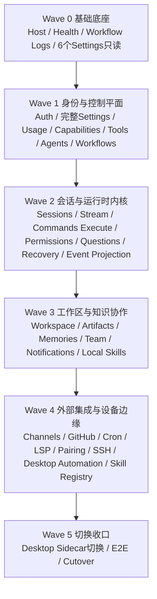

# .agentdocs/workflow/260418-net10-网关功能迁移清单图.md

## Task Overview
- 目标：为 `services/agent-gateway` → `services/agent-gateway-dotnet` 的一比一迁移建立一份**非常详细、可持续维护、可防遗漏、可防重复**的功能清单记录图。
- 范围：覆盖 TS gateway、.NET 10 gateway、关键持久化/运行时模型、桌面 sidecar 切换路径。
- 非目标：本次不直接修改 gateway 业务代码，不把清单误当作排期承诺；它是迁移真相账本，不是营销式路线图。

## Current Analysis
- TS gateway 仍是当前功能真值源：`services/agent-gateway/src/index.ts` 注册了 auth、sessions、stream、settings、team、workspace、artifacts、channels、github、cron、lsp、pairing、desktop-automation 等完整能力面。
- .NET 10 gateway 当前只具备骨架与局部迁移：`services/agent-gateway-dotnet/src/OpenAWork.Gateway.Host/Program.cs` 只有 `/health`、`/stream/sse`、`/stream/ws` skeleton 与 6 个 settings 只读接口。
- `.NET` 当前持久化模型仍非常薄：`services/agent-gateway-dotnet/src/OpenAWork.Gateway.Persistence.EFCore/GatewayDbContext.cs` 只包含 `Users`、`UserSettings`、`RequestWorkflowLogs`。
- 真正高风险区域不在“接口数量”，而在 `message_v2 / event_log / session_run_events / session_runtime_threads / permission_requests / question_requests / session_snapshots` 这类运行时与恢复闭环。
- 桌面端仍绑定 TS Node sidecar：`apps/desktop/src-tauri/scripts/bundle-sidecar.sh`、`apps/desktop/src-tauri/src/lib.rs`、`apps/desktop/src-tauri/tauri.conf.json`。

## Solution Design
- 采用**唯一清单 ID + 波次 + 前置依赖 + 完成定义 + 证据链接**的记账方式。
- 采用“**能力闭环**”而不是“文件搬运”作为粒度：一个事项至少要同时考虑 route、contract、data、runtime、test 五个面。
- 所有事项必须只出现一次；共享前置能力单列成独立事项，由后续事项引用，禁止在多个波次重复登记。
- 当前文档应长期保留在 `Active Workflows`，直到 `.NET` sidecar 正式接管桌面与主流量后再移入 `done/`。

## Complexity Assessment
- Atomic steps: 3–4（读取规范、设计结构、创建文档、更新索引）→ +0
- Parallel streams: 否 → +0
- Modules/systems/services: 3+（TS gateway、.NET gateway、desktop sidecar）→ +1
- Long step (>5 min): 是 → +1
- Persisted review artifacts: 是 → +1
- OpenCode available: 是 → -1
- **Total score**: 2
- **Chosen mode**: Lightweight
- **Routing rationale**: 本次核心交付是可长期维护的 workflow/checklist 文档，需要持久化，但不需要 runtime/master_plan 编排。

## Maintenance Rules

### 状态图例
- `✅ 已完成`：contract / data / runtime / test / evidence 已闭环。
- `🚧 进行中`：已经有明确实现或 PR，但未满足完成定义。
- `🟡 部分完成`：只迁了一部分能力，不能宣称 domain 完成。
- `⬜ 未开始`：尚未进入实施。
- `⛔ 阻塞`：已识别但被上游能力或外部条件阻塞。

### 去重规则
1. **一项能力只记一次**：按“能力闭环”登记，不按文件、PR、负责人重复拆账。
2. **共享基础设施单列**：如 `refresh_tokens`、`message_v2`、`session_run_events`、`.NET sidecar`，只建一条主事项，消费方通过“前置依赖”引用。
3. **读写分离单独记账**：同一资源的 read / write 如风险级别不同，必须拆成两条事项。
4. **route 不等于能力**：多个 route 共享一个 runtime/data 闭环时，合并成一条能力项；一个 route 同时跨多个闭环时，拆到对应闭环项下。
5. **禁止重复完成**：某事项若已 `✅`，后续 PR 只能补充 evidence/notes，不得重新建同义事项。

### 更新规则
- 每条事项至少维护：`状态`、`证据`、`最新 PR/提交`、`备注`。
- 只有当 TS / .NET 对拍、测试、手动 QA 都满足时，才能把状态改成 `✅ 已完成`。
- 若 TS 真值行为发生变化，先更新本清单的“完成定义/备注”，再推进 .NET 代码调整。
- **任何调整前必须先读旧版实现**：至少阅读对应 TS route、相关 helper/store、相关测试或调用方，确认旧行为后才能改 `.NET`；禁止凭直觉或只看接口名盲改。
- **旧版对照必须留痕**：每次 PR 都要在描述或本清单备注中写明“本次对照了哪些 TS 文件/行为”，否则视为研究不完整。

### 单项更新模板
后续任何事项进入实施时，建议在 PR 描述、周报或本文件附录里使用统一模板记录，避免只改状态不留证据：

```markdown
#### <ITEM-ID>
- Status: ⬜ / 🚧 / 🟡 / ✅ / ⛔
- Owner: <负责人>
- Latest PR / Commit: <链接或提交号>
- Legacy Source Review:
  - ts files reviewed:
  - behavior notes:
- Evidence:
  - contract diff:
  - integration/scenario test:
  - manual QA:
- Notes:
  - <风险、偏差、遗留项>
```

### 完成定义统一口径
除特别说明外，每条事项默认都要满足：
1. **Contract parity**：请求/响应 shape、默认值、错误码与 TS 对齐。
2. **Data parity**：数据库模型、默认数据、迁移/基线兼容与 TS 语义对齐。
3. **Runtime parity**：运行态/恢复态/副作用与 TS 对齐。
4. **Test parity**：至少具备 integration test，复杂运行时还要有 scenario verification。
5. **Evidence**：清单中可落链接到文件、测试或 PR。

## Wave Map



## Implementation Plan
- [x] T-00: 读取 `.agentdocs` 索引与现有命名规范 ✅
- [x] T-01: 确定清单粒度、状态体系与去重规则 ✅
- [ ] T-02: 后续迁移过程中持续更新本清单的状态、证据与备注

## Migration Checklist

### Wave 0 — 已有底座与基线复核

| ID | 事项 | TS 真值 | .NET 目标 | 当前状态 | 前置依赖 | 完成定义 |
|---|---|---|---|---|---|---|
| BASE-001 | Host skeleton / Minimal API / ProblemDetails | `services/agent-gateway/src/index.ts` | `services/agent-gateway-dotnet/src/OpenAWork.Gateway.Host/Program.cs` | ✅ 已完成 | 无 | Host 可启动，异常输出与基础路由承载稳定 |
| BASE-002 | `/health` | TS health 行为 | `.NET /health` | ✅ 已完成 | BASE-001 | health contract 稳定且已有 integration test |
| BASE-003 | Request workflow 树日志兼容 | `request-workflow.ts` / `request-workflow-log-store.ts` | `RequestWorkflowMiddleware` + `RequestWorkflowLogs` | ✅ 已完成 | BASE-001 | `workflow_json` 结构、落库与读取路径稳定 |
| BASE-004 | SQLite / PostgreSQL provider 基础设施 | `services/agent-gateway/src/db.ts` | `Persistence.Sqlite` / `Persistence.PostgreSql` | ✅ 已完成 | BASE-001 | provider 注册、migrations、baseline 自愈可用 |
| BASE-005 | SSE / WS skeleton 入口 | `stream-routes-plugin.ts` | `Program.cs` skeleton endpoints | ✅ 已完成 | BASE-001 | 仅承接骨架，不误报为 runtime parity |
| BASE-006 | settings 首批 6 个只读接口 | `routes/settings.ts` | `SettingsRouteGroupExtensions.cs` | ✅ 已完成 | BASE-001, BASE-004 | 已有 tests 与手动 QA |
| BASE-007 | 桌面仍使用 TS Node sidecar 的基线确认 | `apps/desktop/src-tauri/*` | Wave 5 前保持现状 | ✅ 已确认 | 无 | 在 cutover 前不得误切 `.NET` sidecar |

### Wave 1 — 身份与控制平面

| ID | 事项 | TS 真值 | .NET 目标 | 当前状态 | 前置依赖 | 完成定义 |
|---|---|---|---|---|---|---|
| AUTH-001 | `/auth/login` | `services/agent-gateway/src/auth.ts` | 新增 .NET auth route/handler | ✅ 已完成 | BASE-001, BASE-004 | 登录、密码校验、JWT 签发与 TS 对齐 |
| AUTH-002 | `/auth/refresh` | `src/auth.ts` | 新增 .NET refresh handler | ✅ 已完成 | AUTH-001, AUTH-005 | refresh token 轮换、失效与错误码对齐 |
| AUTH-003 | `/auth/logout` | `src/auth.ts` | 新增 .NET logout handler | ✅ 已完成 | AUTH-001, AUTH-005 | token 清理与 side effect 对齐 |
| AUTH-004 | `/auth/register` | `src/auth.ts` | 新增 .NET register handler | ✅ 已完成 | BASE-004 | users 插入、默认 skills/template 初始化语义对齐 |
| AUTH-005 | `refresh_tokens` 持久化模型 | `src/db.ts` + `src/auth.ts` | 新增 EF Core entity/migration | ✅ 已完成 | BASE-004 | schema、索引、过期策略与 TS 语义对齐 |
| CTRL-001 | `/settings/providers` 读取 | `routes/settings.ts` | .NET query/route | ✅ 已完成 | BASE-006 | provider materialization 与默认 thinking 对齐 |
| CTRL-002 | `/settings/providers` 写入 | `routes/settings.ts` | .NET command/route | ✅ 已完成 | CTRL-001 | providers / activeSelection / defaultThinking 写回一致 |
| CTRL-003 | `/settings/active-selection` 读取 | `routes/settings.ts` | .NET query/route | ✅ 已完成 | CTRL-001 | 默认选择与 provider fallback 对齐 |
| CTRL-004 | `/settings/active-selection` 写入 | `routes/settings.ts` | .NET command/route | ✅ 已完成 | CTRL-003 | contract、错误码与 JSON 结构对齐 |
| CTRL-005 | `/settings/mcp-servers` 读取 | `routes/settings.ts` | .NET query/route | ✅ 已完成 | BASE-006 | 空数组、坏 JSON 降级语义对齐 |
| CTRL-006 | `/settings/mcp-servers` 写入 | `routes/settings.ts` | .NET command/route | ✅ 已完成 | CTRL-005 | 写入后读取回显一致 |
| CTRL-007 | `/settings/diagnostics` 清理 | `routes/settings.ts` | .NET command/route | ✅ 已完成 | BASE-003 | audit_logs / session 归属过滤语义对齐 |
| CTRL-008 | `/settings/dev-logs` | `routes/settings.ts` | .NET query/route | ✅ 已完成 | BASE-003, CTRL-007 | tool logs + workflow logs 聚合视图对齐 |
| CTRL-009 | `/settings/version` | `routes/settings.ts` | .NET query/route | ✅ 已完成 | BASE-001 | 当前版本/最新版本字段语义对齐 |
| CTRL-010 | `/settings/companion` 与 `/settings/companion/chat` | `routes/settings.ts` | .NET route/handler | ✅ 已完成 | CTRL-001 | companion 配置、chat 调用与错误处理对齐 |
| CTRL-011 | `/usage/*` | `routes/usage.ts` | .NET route/handler | ⬜ 未开始 | CTRL-001 | usage 聚合字段、过滤与分页对齐 |
| CTRL-012 | `/capabilities` | `routes/capabilities.ts` | .NET route/handler | ✅ 已完成 | CTRL-001, CTRL-013 | 能力目录聚合、排序、可见性规则对齐 |
| CTRL-013 | `/tools/definitions` | `routes/tools.ts` | .NET route/handler | ✅ 已完成 | BASE-001 | tool definition shape 与启用策略对齐 |
| CTRL-014 | `/agents` 管理面 | `routes/agents.ts` | .NET CRUD/query routes | 🚧 进行中 | CTRL-001 | managed agent contract 与校验对齐 |
| CTRL-015 | `/workflows` 模板/优化/翻译面 | `routes/workflows.ts` | .NET workflow routes | 🚧 进行中 | CTRL-014 | workflow templates schema、optimize/translate 行为对齐 |

### Wave 2 — 会话与运行时内核

| ID | 事项 | TS 真值 | .NET 目标 | 当前状态 | 前置依赖 | 完成定义 |
|---|---|---|---|---|---|---|
| DATA-001 | `sessions` 持久化模型 | `src/db.ts` | EF Core entity/migration | 🚧 进行中 | BASE-004, AUTH-* | 会话主表字段、索引、state_status 语义对齐 |
| DATA-002 | `session_messages` legacy 存储 | `src/db.ts` | EF Core entity/migration | ⬜ 未开始 | DATA-001 | legacy message 数据可读且不破坏迁移路径 |
| DATA-003 | `message_v2` | `message-v2-adapter.ts` + `db.ts` | EF Core entity/migration | ⬜ 未开始 | DATA-001 | v2 message 读取、写入、迁移语义对齐 |
| DATA-004 | `part_v2` | `message-v2-adapter.ts` + `db.ts` | EF Core entity/migration | ⬜ 未开始 | DATA-003 | part 粒度、顺序、读取聚合对齐 |
| DATA-005 | `event_log` | `sync-event.ts` + `db.ts` | EF Core entity/migration | 🚧 进行中 | DATA-001 | event 溯源记录与幂等语义对齐 |
| DATA-006 | `event_sequences` | `sync-event.ts` + `db.ts` | EF Core entity/migration | 🚧 进行中 | DATA-005 | sequence 分配与重放顺序对齐 |
| DATA-007 | `session_run_events` | `session-run-events.ts` + `db.ts` | EF Core entity/migration | 🚧 进行中 | DATA-001, DATA-003 | seq、镜像消息、通知联动对齐 |
| DATA-008 | `session_runtime_threads` | `session-runtime-thread-store.ts` + `db.ts` | EF Core entity/migration | 🚧 进行中 | DATA-001 | heartbeat / stale / active 判定对齐 |
| DATA-009 | `session_snapshots` | `session-snapshot-store.ts` + `db.ts` | EF Core entity/migration | ⬜ 未开始 | DATA-001, DATA-003 | snapshot 生成、读取、比较语义对齐 |
| DATA-010 | `session_file_diffs` | `session-file-diff-store.ts` + `db.ts` | EF Core entity/migration | ⬜ 未开始 | DATA-001 | file diff 与 observability 字段语义对齐 |
| DATA-011 | `session_file_backups` | `db.ts` | EF Core entity/migration | ⬜ 未开始 | DATA-010 | backup tier/hash/storage path 对齐 |
| DATA-012 | `permission_requests` | `db.ts` + `routes/permissions.ts` | EF Core entity/migration | 🚧 进行中 | DATA-001 | pending approval、expires_at 语义对齐 |
| DATA-013 | `question_requests` | `db.ts` + `routes/questions.ts` | EF Core entity/migration | 🚧 进行中 | DATA-001 | pending question、expires_at 语义对齐 |
| DATA-014 | `task_parent_auto_resume_contexts` | `db.ts` + `task-parent-auto-resume.ts` | EF Core entity/migration | ✅ 已完成 | DATA-001, DATA-007 | parent/child auto-resume 语义对齐 |
| RUN-001 | `/sessions` 基础 CRUD | `routes/sessions.ts` | .NET route/handler | 🚧 进行中 | DATA-001 | create/list/get/patch/delete 对齐 |
| RUN-002 | `/sessions/search` 与筛选读模型 | `routes/sessions.ts` | .NET route/handler | 🚧 进行中（最小搜索子切片已完成） | RUN-001, DATA-003 | 搜索、排序、分页与 FTS 语义对齐 |
| RUN-003 | `children / tasks / todos / import / truncate` | `routes/sessions.ts` | .NET route/handler | 🚧 进行中（最小读面子切片已完成） | RUN-001, DATA-014 | 子会话、任务、截断、导入行为对齐 |
| RUN-004 | WebSocket stream | `stream-routes-plugin.ts` | .NET WS runtime | 🟡 部分完成 | RUN-001, DATA-007, DATA-008 | 从 skeleton 升级为真实执行/事件流 |
| RUN-005 | active snapshot + SSE / attach / replay | `stream-routes-plugin.ts` | .NET SSE runtime | 🚧 进行中 | RUN-001, DATA-007, DATA-008 | `stream/active`、`Last-Event-ID`、cursor、attach replay 与 live attach 全对齐 |
| RUN-006 | `stop-active` | `stream-routes-plugin.ts` | .NET route/handler | 🚧 进行中 | RUN-005, DATA-008 | stop-any-active-request 与 wait-for-cleanup 语义对齐 |
| RUN-007 | permissions pause / resume | `routes/permissions.ts` | .NET route/handler | ✅ 已完成 | DATA-012, RUN-004 | approve/deny/permanent 后恢复语义对齐（standalone-session scope） |
| RUN-008 | questions reply / resume | `routes/questions.ts` | .NET route/handler | 🚧 进行中（最小 owner-session 子切片已完成） | DATA-013, RUN-004 | question 回答与自动恢复对齐 |
| RUN-009 | commands execute | `routes/commands.ts` | .NET route/handler | 🚧 进行中 | CTRL-012, CTRL-013, RUN-004 | 命令执行、流式输出、handoff/continuation 对齐 |
| RUN-010 | recovery / reconcile / restore | `session-recovery.ts`、`session-runtime-state.ts`、`session-runtime-reconciler.ts` | .NET services | 🚧 进行中（最小子切片已完成） | DATA-007, DATA-008, DATA-009, DATA-010 | tool_result_missing、thinking 恢复、runtime reconcile 对齐 |

### Wave 3 — 工作区、知识与协作面

| ID | 事项 | TS 真值 | .NET 目标 | 当前状态 | 前置依赖 | 完成定义 |
|---|---|---|---|---|---|---|
| PROD-001 | `/workspace` | `routes/workspace.ts` | .NET route/handler | ⬜ 未开始 | RUN-001 | tree/file/search/review/change surface 对齐 |
| PROD-002 | `/artifacts` | `routes/artifacts.ts` | .NET route/handler | ⬜ 未开始 | RUN-001, PROD-001 | artifact create/list/version/revert 对齐 |
| PROD-003 | `/memories` | `routes/memories.ts` | .NET route/handler | ⬜ 未开始 | RUN-001, DATA-003 | memory CRUD、extract settings、session linkage 对齐 |
| PROD-004 | `/notifications` | `routes/notifications.ts` | .NET route/handler | ⬜ 未开始 | DATA-007, PROD-003 | list/read/preferences 行为对齐 |
| PROD-005 | `/team` 与 shared session 读模型 | `routes/team.ts` + `session-shared-read-routes.ts` | .NET route/handler | ⬜ 未开始 | RUN-001, PROD-001 | team/workspace/session share/read model 对齐 |
| PROD-006 | `/local-skills` | `routes/local-skills.ts` | .NET route/handler | ⬜ 未开始 | PROD-001 | 本地 skills discover/install/remove 对齐 |

### Wave 4 — 外部集成与设备边缘

| ID | 事项 | TS 真值 | .NET 目标 | 当前状态 | 前置依赖 | 完成定义 |
|---|---|---|---|---|---|---|
| EDGE-001 | `/skills` registry / install / sync | `routes/skills.ts` | .NET route/handler | ⬜ 未开始 | PROD-006, CTRL-012 | skills registry source、cache、install lifecycle 对齐 |
| EDGE-002 | `/channels` 与 channel runtime | `channels/router.ts` + `channels/*` | .NET route/handler + services | ⬜ 未开始 | RUN-004, PROD-004 | CRUD/start/stop/send/auto-reply 对齐 |
| EDGE-003 | `/github` | `github/router.ts` | .NET route/handler | ⬜ 未开始 | RUN-009 | webhook/trigger/side effect 对齐 |
| EDGE-004 | `/cron` | `cron/router.ts` | .NET route/handler + scheduler | ⬜ 未开始 | RUN-001 | job 调度、恢复、幂等行为对齐 |
| EDGE-005 | `/lsp` | `lsp/router.ts` | .NET route/handler + services | ⬜ 未开始 | PROD-001, RUN-004 | status/diagnostics/install/events 对齐 |
| EDGE-006 | `/pairing` | `routes/pairing.ts` | .NET route/handler | ⬜ 未开始 | AUTH-001, RUN-001 | pairing state / QR / connect 行为对齐 |
| EDGE-007 | `/ssh` | `routes/ssh.ts` | .NET route/handler | ⬜ 未开始 | PROD-001 | SSH connect/file/upload 行为对齐 |
| EDGE-008 | `/desktop-automation` | `routes/desktop-automation.ts` | .NET route/handler | ⬜ 未开始 | PROD-001 | 自动化指令、错误码、平台约束对齐 |

### Wave 5 — 桌面切换与收口

| ID | 事项 | TS 真值 | .NET 目标 | 当前状态 | 前置依赖 | 完成定义 |
|---|---|---|---|---|---|---|
| CUT-001 | `.NET sidecar` 发布产物进入桌面 bundle | `services/agent-gateway-dotnet/scripts/publish-sidecar.sh` | `apps/desktop/src-tauri/sidecars/*` | ⬜ 未开始 | EDGE-* | sidecar 产物可被桌面资源打包消费 |
| CUT-002 | Tauri 启动链改为拉起 `.NET sidecar` | `apps/desktop/src-tauri/src/lib.rs` | 改成启动 `.NET` binary | ⬜ 未开始 | CUT-001 | 桌面启动、停止、状态查询全链路可用 |
| CUT-003 | 桌面打包配置切换 | `bundle-sidecar.sh` / `tauri.conf.json` / `apps/desktop/package.json` | 对齐 .NET sidecar | ⬜ 未开始 | CUT-001 | build/package 产物稳定，去掉 TS sidecar 依赖 |
| CUT-004 | 桌面 E2E / smoke / updater 回归 | `apps/desktop/e2e` + build scripts | E2E against .NET sidecar | ⬜ 未开始 | CUT-002, CUT-003 | onboarding、gateway lifecycle、主页面回归全绿 |
| CUT-005 | Cutover 与 TS fallback 策略冻结 | 当前 TS 主网关 | .NET 主路径 + TS 回退策略 | ⬜ 未开始 | Wave 1–4 全部 ✅ | 切换条件、回退条件、双跑证据与 owner 明确 |

## Recommended PR Breakdown

### PR 拆分总原则
0. **先读旧版，再动代码**：每个 PR 开始前，必须先阅读对应 TS 真值实现（route + helper/store + tests/callers），形成最小行为矩阵后再改 `.NET`。
1. **一个 PR 只推进一个闭环层级**：schema、route、runtime、desktop cutover 不混做。
2. **先数据，后接口，最后恢复/副作用**：所有 Wave 2 高风险能力必须遵守这个顺序。
3. **读写拆分**：同一 settings/skill/config 资源，读路径与写路径尽量分开，避免回归面过大。
4. **外部系统单独 PR**：channels、GitHub、cron、LSP、SSH、desktop automation 各自隔离，避免跨系统回归。
5. **每个 PR 必须引用清单 ID**：PR 标题、描述、测试计划至少出现一次相关 ID。
6. **一个清单 ID 同一时间只能被一个活跃 PR 认领**：避免多人并行重复施工。
7. **如果旧版行为不清楚，先补对照结论，不允许盲猜**：可以延后编码，但不能跳过旧版实现核对。

### 已完成的历史基线包

| PR 包 | 对应清单 ID | 说明 |
|---|---|---|
| PR-00A | `BASE-001` ~ `BASE-005` | .NET 10 gateway skeleton、workflow logs、health、SSE/WS skeleton、provider 基础设施 |
| PR-00B | `BASE-006` | settings 首批 6 个只读接口 |
| PR-00C | `BASE-007` | 桌面仍绑定 TS Node sidecar 的基线确认 |

### Wave 1 — 身份与控制平面 PR 清单

| PR | 对应 ID | 目标 | 必须包含 | 明确不包含 | 合并门槛 |
|---|---|---|---|---|---|
| PR-01 | `AUTH-005` | 建立 `refresh_tokens` 持久化基础 | EF Core entity、migration、旧库 baseline 兼容 | 任何 `/auth/*` route | migration + integration smoke |
| PR-02 | `AUTH-001`, `AUTH-004` | 打通 login/register | password hash 校验、JWT 签发、users 写入 | refresh/logout | login/register contract 对拍 |
| PR-03 | `AUTH-002`, `AUTH-003` | 打通 refresh/logout | refresh token rotate、delete、过期处理 | 任何 settings route | refresh/logout 场景测试 |
| PR-04 | `CTRL-001`, `CTRL-003` | 补齐 providers/active-selection 读路径 | materialize helper、defaultThinking、activeSelection | 写路径 | TS 默认值与空值对拍 |
| PR-05 | `CTRL-002`, `CTRL-004` | 补齐 providers/active-selection 写路径 | command handler、写回逻辑、读取回显 | mcp-servers | 读写往返测试 |
| PR-06 | `CTRL-005`, `CTRL-006` | 补齐 mcp-servers 读写 | 坏 JSON 降级、空数组、保存后回显 | diagnostics/dev-logs | 读写合同 + 手动 QA |
| PR-07 | `CTRL-007`, `CTRL-008`, `CTRL-009` | 补齐 diagnostics/dev-logs/version | workflow log 聚合、diagnostics 清理、版本输出 | companion/chat | dev-logs 视图对拍 |
| PR-08 | `CTRL-010` | 独立收口 companion/chat | companion 配置、chat 请求、错误处理 | 其它 settings 项 | 外部依赖 smoke + fallback 行为 |
| PR-09 | `CTRL-013`, `CTRL-012` | 先做 tools definitions，再做 capabilities | tools catalog、capability 聚合 | agents/workflows | capabilities 输出对拍 |
| PR-10 | `CTRL-011` | 独立补 usage | usage 计算、分页/过滤 | capabilities | usage contract + seeded data test |
| PR-11 | `CTRL-014` | 独立补 agents 管理面 | CRUD、validation、canonical shape | workflows | agent catalog 集成测试 |
| PR-12 | `CTRL-015` | 独立补 workflows 管理面 | templates、optimize/translate、metadata shape | runtime execute | workflow contract + template fixture |

### Wave 2 — 会话与运行时内核 PR 清单

| PR | 对应 ID | 目标 | 必须包含 | 明确不包含 | 合并门槛 |
|---|---|---|---|---|---|
| PR-13 | `DATA-001`, `RUN-001` | 建立 sessions 主表并打通基础 CRUD | `sessions` entity/migration、create/list/get/patch/delete | 搜索、stream | CRUD integration tests |
| PR-14 | `DATA-002` | 补 legacy `session_messages` 支撑层 | legacy 表模型、读兼容策略 | v2 message 路由 | baseline 兼容验证 |
| PR-15 | `DATA-003`, `DATA-004` | 建立 `message_v2/part_v2` 权威消息层 | entities、mapping、append/read helpers | event_log | v2 message round-trip tests |
| PR-16 | `DATA-005`, `DATA-006` | 建立 event sourcing 基础 | `event_log`、`event_sequences`、顺序/幂等逻辑 | session_run_events | sequence/replay tests |
| PR-17 | `DATA-007`, `DATA-008` | 建立 run events + runtime threads | run event 持久化、heartbeat、stale 判定 | attach/replay 路由 | scenario verification |
| PR-18 | `DATA-009`, `DATA-010`, `DATA-011` | 建立 snapshot/file-diff/backup 证据链 | snapshot、file diff、backup schema 与 store | restore route | snapshot/file-diff persistence tests |
| PR-19 | `DATA-012`, `DATA-013` | 建立 permission/question pending 模型 | request tables、expires_at、lookup/store | route 恢复逻辑 | approval/question persistence tests |
| PR-20 | `DATA-014` | 建立 parent auto-resume 上下文模型 | schema、store、cleanup 语义 | child session route | auto-resume persistence tests |
| PR-21 | `RUN-002` | 独立补 sessions 搜索与筛选 | search、排序、分页、FTS/索引策略 | children/tasks/import | 搜索对拍数据集 |
| PR-22 | `RUN-003` | 独立补 children/tasks/todos/import/truncate | advanced session operations | realtime stream | 多场景回归测试 |
| PR-23 | `RUN-004` | 把 WS skeleton 升级为真实 stream runtime | auth、session ownership、runtime dispatch、event pushing | SSE attach/replay | WS scenario green |
| PR-24 | `RUN-005` | 独立实现 active snapshot + SSE attach/replay | `stream/active`、`Last-Event-ID`、cursor、afterSeq、replay envelopes | stop-active | SSE replay scenario green |
| PR-25 | `RUN-006` | 补 stop-active | stop-any-active-request 语义 | permissions/questions | 手动 stop-active QA |
| PR-26 | `RUN-007`, `RUN-008` | 接 permissions/questions 恢复链 | approve/deny/reply、resume hooks | commands execute | permission/question scenario green |
| PR-27 | `RUN-009` | 独立补 commands execute | command catalog、execution、stream output | recovery/reconcile | execute 流式回归 |
| PR-28 | `RUN-010` | 独立补 recovery/reconcile/restore | runtime reconcile、tool_result_missing、restore service | 新增外部集成 | 恢复场景与失败恢复测试 |

### Wave 3 — 工作区、知识与协作面 PR 清单

| PR | 对应 ID | 目标 | 必须包含 | 明确不包含 | 合并门槛 |
|---|---|---|---|---|---|
| PR-29 | `PROD-001` | 独立补 workspace | tree/file/search/review/change | artifacts | path safety + workspace integration tests |
| PR-30 | `PROD-002` | 独立补 artifacts | create/list/version/revert | memories | artifact lifecycle tests |
| PR-31 | `PROD-003` | 独立补 memories | CRUD、extract settings、session linkage | notifications | memory contract + seeded tests |
| PR-32 | `PROD-004` | 独立补 notifications | list/read/preferences、run event linkage | team | notification view tests |
| PR-33 | `PROD-005` | 独立补 team/shared session 读模型 | team/workspace/session share surfaces | local-skills | team read-model integration tests |
| PR-34 | `PROD-006` | 独立补 local-skills | discover/install/remove、本地文件系统约束 | remote registry sync | local skills QA + filesystem safety |

### Wave 4 — 外部集成与设备边缘 PR 清单

| PR | 对应 ID | 目标 | 必须包含 | 明确不包含 | 合并门槛 |
|---|---|---|---|---|---|
| PR-35 | `EDGE-001` | 独立补 skills registry / install / sync | registry source、cache、install lifecycle | channels | registry sync tests |
| PR-36 | `EDGE-002` | 独立补 channels runtime | CRUD/start/stop/send/auto-reply | GitHub、cron | per-channel smoke plan |
| PR-37 | `EDGE-003` | 独立补 GitHub 集成 | webhook、trigger、issue/PR side effect | cron | webhook scenario tests |
| PR-38 | `EDGE-004` | 独立补 cron | scheduler、恢复、幂等执行 | pairing | scheduler recovery tests |
| PR-39 | `EDGE-005` | 独立补 LSP | status/diagnostics/install/events | ssh | LSP integration smoke |
| PR-40 | `EDGE-006` | 独立补 pairing | QR、pairing state、connect flow | ssh / desktop automation | mobile/desktop pairing QA |
| PR-41 | `EDGE-007` | 独立补 SSH | connect/file/upload | desktop automation | SSH smoke + failure path |
| PR-42 | `EDGE-008` | 独立补 desktop automation | 自动化动作、平台约束、错误处理 | 桌面 sidecar 切换 | desktop automation smoke |

### Wave 5 — 桌面切换与最终收口 PR 清单

| PR | 对应 ID | 目标 | 必须包含 | 明确不包含 | 合并门槛 |
|---|---|---|---|---|---|
| PR-43 | `CUT-001` | 让 `.NET sidecar` 正式进入桌面 bundle 流程 | publish artifact、bundle input、资源路径 | 启动链切换 | build/package smoke |
| PR-44 | `CUT-002`, `CUT-003` | 切换 Tauri 启动链与打包配置 | `lib.rs`、`tauri.conf.json`、bundle script、package script | E2E 与 cutover runbook | desktop launch + package green |
| PR-45 | `CUT-004` | 独立做桌面 E2E / smoke / updater 回归 | onboarding、gateway lifecycle、核心页面 | cutover 决策 | E2E 全绿 |
| PR-46 | `CUT-005` | 冻结 cutover 与 TS fallback 策略 | 切换门槛、回退门槛、owner、runbook、双跑证据 | 新功能开发 | cutover 文档评审通过 |

### PR 认领与执行建议
- `PR-13` 之后进入严格串行主线：`PR-13 → PR-15 → PR-17 → PR-23 → PR-24 → PR-28` 是 Wave 2 的最小主干，尽量不要并行打散。
- 控制平面中的 `PR-04 ~ PR-12` 可以有限并行，但必须保证 `AUTH-*` 先于任何需要 user identity 的写路径。
- 外部集成 PR 一律在 Wave 2 / Wave 3 全绿后再启动，避免把排障噪音引入 runtime 主干。
- 每个 PR 合并后，必须同步更新本文件中对应 ID 的 `当前状态`，并在备注中追加 PR 链接，否则视为未完成记账。

#### CTRL-014
- Status: 🚧 进行中
- Latest Work: 2026-04-19 当前工作树已新增 `.NET` `/agents` contracts / application handlers / host route / integration tests
- Legacy Source Review:
  - ts files reviewed: `services/agent-gateway/src/routes/agents.ts`、`services/agent-gateway/src/agent-catalog.ts`、`services/agent-gateway/src/__tests__/agents-routes.test.ts`
  - behavior notes: builtin/custom 双来源聚合、`user_settings.agent_catalog` 持久化、builtin 仅允许模型配置更新、`agent_preferences` legacy fallback
- Evidence:
  - contract diff: `services/agent-gateway-dotnet/src/OpenAWork.Gateway.Contracts/Agents/ManagedAgentResponse.cs`
  - integration/scenario test: `services/agent-gateway-dotnet/tests/OpenAWork.Gateway.IntegrationTests/AgentsEndpointTests.cs`
  - web/gateway parity smoke: `pnpm --filter @openAwork/web exec vitest run src/pages/AgentsPage.test.tsx`、`pnpm --filter @openAwork/agent-gateway exec vitest run src/__tests__/agents-routes.test.ts` ✅
  - .NET verify entrypoint: `services/agent-gateway-dotnet/scripts/verify-local.sh`
  - manual QA / .NET build-test: 待补（当前环境缺少 `dotnet`）
- Notes:
  - 当前只能标记为“进行中”：后端实现、前端 builtin save 兼容与 TS 侧可运行测试已收口，但 .NET build/test/manual QA 证据仍待可运行的 `dotnet` 环境补齐

#### CTRL-015
- Status: 🚧 进行中
- Latest Work: 2026-04-19 当前工作树已新增 `.NET` `/workflows/templates`、`/workflows/optimize-prompt`、`/workflows/translate` 的 contracts / application handlers / host route / integration tests
- Legacy Source Review:
  - ts files reviewed: `services/agent-gateway/src/routes/workflows.ts`、`services/agent-gateway/src/default-workflow-templates.ts`、`services/agent-gateway/src/team-template-metadata.ts`、`packages/web-client/src/workflows.ts`
  - behavior notes: 主线是 team-playbook 模板控制面；模板表与 seed 已在 `.NET` 存在，本轮主要补 route/handler/tests；optimize/translate 为附属 LLM 端点
- Evidence:
  - contract diff: `services/agent-gateway-dotnet/src/OpenAWork.Gateway.Contracts/Workflows/*`
  - integration/scenario test: `services/agent-gateway-dotnet/tests/OpenAWork.Gateway.IntegrationTests/WorkflowsEndpointTests.cs`
  - TS truth smoke: `pnpm --filter @openAwork/agent-gateway exec vitest run src/__tests__/workflows-routes.test.ts src/__tests__/default-workflow-templates.test.ts` ✅
  - web-client smoke: `pnpm --filter @openAwork/web-client exec vitest run src/__tests__/workflows-client.test.ts` ✅
  - manual QA / .NET build-test: 待补（当前环境缺少 `dotnet`）
- Notes:
  - 当前为“进行中”：控制面主线代码、web-client translate 契约、深层 teamTemplate 校验与并发 translate 已收口；focused review 已通过，但 `.NET` 真实 build/test/manual QA 仍待可运行的 `dotnet` 环境补证

#### DATA-001 / RUN-001
- Status: 🚧 进行中
- Latest Work: 2026-04-19 当前工作树已新增 `.NET` sessions 主表、双 provider migrations、`/sessions` 基础 CRUD、metadata/path 校验与 integration tests
- Legacy Source Review:
  - ts files reviewed: `services/agent-gateway/src/routes/sessions.ts`、`services/agent-gateway/src/routes/session-route-helpers.ts`、`services/agent-gateway/src/session-workspace-metadata.ts`、`services/agent-gateway/src/workspace-paths.ts`
  - behavior notes: create 回 `{ sessionId }`；list 回 `{ sessions }`；get 回 `{ session }`；patch 回 `{ ok: true }`；delete 回 `{ ok: true, deletedSessionIds }`；`workingDirectory` 必须为绝对路径；`teamDefinition.source` / `requiredRoleBindings` 必填；无实际变更时不得刷新 `updated_at`
- Evidence:
  - contract/entity diff: `services/agent-gateway-dotnet/src/OpenAWork.Gateway.Contracts/Sessions/SessionResponses.cs`、`services/agent-gateway-dotnet/src/OpenAWork.Gateway.Persistence.EFCore/Entities/SessionRecord.cs`
  - integration/scenario test: `services/agent-gateway-dotnet/tests/OpenAWork.Gateway.IntegrationTests/SessionsEndpointTests.cs`
  - TS/web-client smoke: `pnpm --filter @openAwork/agent-gateway exec vitest run src/__tests__/session-workspace-metadata.test.ts src/__tests__/session-workspace-routes.test.ts`、`pnpm --filter @openAwork/web-client exec vitest run src/__tests__/sessions-client.test.ts` ✅
  - manual QA / .NET build-test: 待补（当前环境缺少 `dotnet`）
- Notes:
  - 当前为“进行中”：主表与基础 CRUD 代码已收口，focused review 已通过，但 `.NET` 真实 build/test/manual QA 仍待可运行的 `dotnet` 环境补证

#### DATA-003 / DATA-004
- Status: 🚧 进行中
- Latest Work: 2026-04-19 当前工作树已新增 `.NET` `message_v2 / part_v2` entities、双 provider migrations、`IMessageV2Store` / `MessageV2Store`、request-scope helper 与 round-trip integration tests，并把 `GET /sessions/{id}` 接到了 V2 transcript 聚合读模型
- Legacy Source Review:
  - ts files reviewed: `services/agent-gateway/src/db.ts`、`services/agent-gateway/src/message-v2-schema.ts`、`services/agent-gateway/src/message-store-v2.ts`、`services/agent-gateway/src/message-v2-adapter.ts`
  - behavior notes: message 按 `(time_created, id)`；part 按 `(message_id, id)` / `(time_created, id)`；duplicate id 走幂等 upsert；request-scope helper 与 V2→V1 transcript 投影是后续 stream/runtime 的关键前置能力
- Evidence:
  - schema/store diff: `services/agent-gateway-dotnet/src/OpenAWork.Gateway.Persistence.EFCore/Entities/MessageV2Record.cs`、`.../PartV2Record.cs`、`.../Stores/MessageV2Store.cs`
  - round-trip test: `services/agent-gateway-dotnet/tests/OpenAWork.Gateway.IntegrationTests/MessageV2StoreTests.cs`
  - transcript projection test: `services/agent-gateway-dotnet/tests/OpenAWork.Gateway.IntegrationTests/SessionsEndpointTests.cs`
  - TS truth smoke: `pnpm --filter @openAwork/agent-gateway exec vitest run src/__tests__/message-v2-store.test.ts src/__tests__/message-v2-adapter.test.ts src/__tests__/message-v2-sync-event.test.ts` ✅
  - broader smoke: `pnpm --filter @openAwork/agent-gateway exec vitest run src/__tests__/message-v2-store.test.ts src/__tests__/message-v2-adapter.test.ts src/__tests__/message-v2-sync-event.test.ts src/__tests__/session-workspace-metadata.test.ts`、`pnpm --filter @openAwork/web-client exec vitest run src/__tests__/sessions-client.test.ts` ✅
  - manual QA / .NET build-test: 待补（当前环境缺少 `dotnet`）
- Notes:
  - 当前为“进行中”：权威消息层、request-scope helper 与最小 transcript 闭环已落地，focused re-review 已通过；剩余唯一缺口是 `.NET` 真实 build/test/manual QA 仍待可运行的 `dotnet` 环境补证

#### RUN-002
- Status: 🚧 进行中（最小搜索子切片已完成）
- Latest Work: 2026-04-22 当前工作树已新增 `.NET` `GET /sessions/search`、`SearchSessionsQuery` 最小读模型、搜索响应 contract 与 `SessionsSearchTests.cs`，支持 `q + limit`、`text / modified_files_summary` 命中、当前用户隔离、按 `createdAtMs DESC` 排序与 `<mark>` snippet。
- Legacy Source Review:
  - ts files reviewed: `services/agent-gateway/src/routes/sessions.ts`、`services/agent-gateway/src/session-search-store.ts`、`services/agent-gateway/src/__tests__/session-search-store.test.ts`、`packages/web-client/src/sessions.ts`
  - behavior notes: TS route 真值只收 `q + limit` 并回 `{ results }`；完整 TS 实现另有 `session_messages_fts / bm25 / snippet(...)` 与 legacy hydrate，但本轮明确只做最小读闭环，不宣称 full FTS parity。
- Evidence:
  - .NET route/query diff: `services/agent-gateway-dotnet/src/OpenAWork.Gateway.Host/Routes/SessionsRouteGroupExtensions.cs`、`services/agent-gateway-dotnet/src/OpenAWork.Gateway.Application/Features/Sessions/SessionSearchQuery.cs`
  - contract diff: `services/agent-gateway-dotnet/src/OpenAWork.Gateway.Contracts/Sessions/SessionResponses.cs`
  - integration/scenario test: `services/agent-gateway-dotnet/tests/OpenAWork.Gateway.IntegrationTests/SessionsSearchTests.cs`
  - TS/web-client smoke: `pnpm --filter @openAwork/agent-gateway exec vitest run src/__tests__/session-search-store.test.ts`、`pnpm --filter @openAwork/web-client exec vitest run src/__tests__/sessions-client.test.ts` ✅
  - manual QA / .NET build-test: 待补（当前环境缺少 `dotnet`，且 `csharp-ls` 未安装）
- Notes:
  - 当前最小搜索子切片的正式复核已通过：goal / QA / code quality / security / context mining 全 PASS。
  - 当前实现固定在最小边界：只基于现有 `sessions + message_v2 + part_v2` 做读模型搜索，不引入 durable FTS 表层；`/sessions/search` 仍不能宣称整个 RUN-002 已全量完成。
  - 后续剩余面集中在：完整分页/FTS/bm25/snippet parity、legacy `session_messages` hydrate，以及在可运行 `dotnet` 环境下补 build/test/manual QA 证据。

#### DATA-005 / DATA-006
- Status: 🚧 进行中
- Latest Work: 2026-04-19 当前工作树已新增 `.NET` `event_log / event_sequences` entities、双 provider migrations、`ISyncEventStore` / `SyncEventStore` 与 round-trip integration tests；同时把 TS `sync-event.ts` 运行时路径收口为唯一 `(aggregate_id, seq)` + 事务内原子分配 seq
- Legacy Source Review:
  - ts files reviewed: `services/agent-gateway/src/db.ts`、`services/agent-gateway/src/sync-event.ts`、`services/agent-gateway/src/__tests__/message-v2-sync-event.test.ts`
  - behavior notes: per-aggregate seq、duplicate eventId no-op、replay 按 `seq ASC`；TS 与 .NET 两侧都已收口为“唯一 `(aggregate_id, seq)` + 原子 seq 分配”
- Evidence:
  - schema/store diff: `services/agent-gateway-dotnet/src/OpenAWork.Gateway.Persistence.EFCore/Entities/EventLogRecord.cs`、`.../EventSequenceRecord.cs`、`.../Stores/SyncEventStore.cs`
  - round-trip test: `services/agent-gateway-dotnet/tests/OpenAWork.Gateway.IntegrationTests/SyncEventStoreTests.cs`
  - TS truth smoke: `pnpm --filter @openAwork/agent-gateway exec vitest run src/__tests__/message-v2-sync-event.test.ts` ✅
  - broader smoke: `pnpm --filter @openAwork/agent-gateway exec vitest run src/__tests__/message-v2-sync-event.test.ts src/__tests__/message-v2-store.test.ts src/__tests__/message-v2-adapter.test.ts`、`pnpm --filter @openAwork/agent-gateway run test:message-v2:projection` ✅
  - manual QA / .NET build-test: 待补（当前环境缺少 `dotnet`）
- Notes:
  - 当前为“进行中”：溯源层 schema/store 与 TS 运行时路径都已收口，focused review 已通过；剩余唯一缺口是 `.NET` 真实 build/test/manual QA 仍待可运行的 `dotnet` 环境补证

#### DATA-007 / DATA-008
- Status: 🚧 进行中
- Latest Work: 2026-04-20 当前工作树已新增 `.NET` `session_run_events / session_runtime_threads` entities、双 provider migrations、durable run event/runtime thread stores、assistant-event mirror 兼容位，并把 `GET /sessions/{id}` 接到了真实 `runEvents` durable 数据
- Legacy Source Review:
  - ts files reviewed: `services/agent-gateway/src/db.ts`、`services/agent-gateway/src/session-run-events.ts`、`services/agent-gateway/src/session-runtime-thread-store.ts`、`services/agent-gateway/src/routes/stream-routes-plugin.ts`、`services/agent-gateway/src/routes/stream.ts`
  - behavior notes: request-scoped `seq` 自动分配、after-seq replay、active-thread freshness、assistant-event mirror；TS 与 .NET 两侧都已收口 attach/replay 最敏感的 bookend/fresh-retry 语义
- Evidence:
  - schema/store diff: `services/agent-gateway-dotnet/src/OpenAWork.Gateway.Persistence.EFCore/Entities/SessionRunEventRecord.cs`、`.../SessionRuntimeThreadRecord.cs`、`.../Stores/SessionRunEventStore.cs`、`.../SessionRuntimeThreadStore.cs`
  - round-trip test: `services/agent-gateway-dotnet/tests/OpenAWork.Gateway.IntegrationTests/SessionRunEventStoreTests.cs`、`.../SessionRuntimeThreadStoreTests.cs`
  - transcript/durable read test: `services/agent-gateway-dotnet/tests/OpenAWork.Gateway.IntegrationTests/SessionsEndpointTests.cs`
  - TS truth smoke: `pnpm --filter @openAwork/agent-gateway exec vitest run src/__tests__/session-run-events.test.ts` ✅
  - broader smoke: `pnpm --filter @openAwork/agent-gateway exec vitest run src/__tests__/stream-replay.test.ts src/__tests__/stream-attach-route.test.ts src/__tests__/session-run-events.test.ts src/__tests__/session-runtime-state.test.ts src/__tests__/session-runtime-reconciler.test.ts` ✅
  - verification: `pnpm --filter @openAwork/agent-gateway exec tsx src/verification/verify-stream-replay-bookend.ts`、`.../verify-stream-attach-recovery.ts` ✅
  - manual QA / .NET build-test: 待补（当前环境缺少 `dotnet`）
- Notes:
  - 当前为“进行中”：durable run events、runtime thread freshness、assistant-event mirror 与 attach/replay 真值语义都已收口，focused review 已通过；剩余唯一缺口是 `.NET` 真实 build/test/manual QA 仍待可运行的 `dotnet` 环境补证

#### DATA-012 / DATA-013
- Status: 🚧 进行中
- Latest Work: 2026-04-20 当前工作树已新增 `.NET` `permission_requests / question_requests` entities、configurations、store abstraction、EFCore stores、双 provider migrations / snapshots，并补齐最小持久化 round-trip 测试。
- Legacy Source Review:
  - ts files reviewed: `services/agent-gateway/src/db.ts`、`services/agent-gateway/src/routes/permissions.ts`、`services/agent-gateway/src/routes/questions.ts`、`services/agent-gateway/src/tool-sandbox.ts`、`services/agent-gateway/src/permission-contract.ts`
  - behavior notes: `permission_requests` 持有 `request_payload_json`、`always_json`、`expires_at(ms)`，pending lookup 走 `session + toolName + scope`；`question_requests` 持有 `user_id`、`questions_json`、`answer_json`、`request_payload_json`、`expires_at(ms)`，pending lookup 走 `session + title`；过期收敛分别为 `rejected + decision=reject` 与 `dismissed`。
- Evidence:
  - .NET schema/store diff: `services/agent-gateway-dotnet/src/OpenAWork.Gateway.Persistence.EFCore/Entities/PermissionRequestRecord.cs`、`.../QuestionRequestRecord.cs`、`.../Configurations/PermissionRequestRecordConfiguration.cs`、`.../Configurations/QuestionRequestRecordConfiguration.cs`、`.../Stores/PermissionRequestStore.cs`、`.../Stores/QuestionRequestStore.cs`
  - migration/snapshot: `services/agent-gateway-dotnet/src/OpenAWork.Gateway.Persistence.Sqlite/Migrations/20260420164000_AddPendingInteractionRequests.cs`、`.../PostgreSql/Migrations/20260420164000_AddPendingInteractionRequests.cs`、两份 `GatewayDbContextModelSnapshot.cs`
  - integration/scenario test: `services/agent-gateway-dotnet/tests/OpenAWork.Gateway.IntegrationTests/PendingInteractionStoreTests.cs`
  - TS truth smoke: `pnpm --filter @openAwork/agent-gateway exec vitest run src/__tests__/permissions-routes.request-binding.test.ts src/__tests__/questions-routes.plan-mode.test.ts` ✅
  - manual QA / .NET build-test: 待补（当前环境缺少 `dotnet`，且 `csharp-ls` 未安装）
- Notes:
  - 当前为“进行中”：`DATA-012 / DATA-013` 代码主线、持久化测试与账本同步已收口，但 `.NET` 真实 build/test/manual QA 证据仍待可运行的 `dotnet` 环境补齐。
  - 本轮显式保持 scope 在 durable layer，不提前把 permissions/questions route、resume hooks 与 commands execute 混入。

#### RUN-005
- Status: 🚧 进行中
- Latest Work: 2026-04-20 当前工作树已新增 `.NET` `SessionRunEventEnvelopeSupport`、`ISessionRunEventBroadcaster` / `InMemorySessionRunEventBroadcaster`、`GET /sessions/{id}/stream/active`、`GET /sessions/{id}/stream/attach`，并把 `RUN-004` 的 runtime event emit 接到了 request-scoped live broadcaster。
- Legacy Source Review:
  - ts files reviewed: `services/agent-gateway/src/routes/stream-routes-plugin.ts`、`services/agent-gateway/src/run-event-envelope.ts`、`services/agent-gateway/src/session-run-events.ts`、`services/agent-gateway/src/session-runtime-thread-store.ts`、`services/agent-gateway/src/__tests__/stream-attach-route.test.ts`、`services/agent-gateway/src/verification/verify-stream-attach-recovery.ts`
  - behavior notes: `stream/active` 返回 fresh runtime thread + latest durable seq；`stream/attach` 使用 query token 鉴权；cursor 优先级按 route 真值固定为 `Last-Event-ID ?? afterSeq`；inactive terminal replay 后结束；inactive non-terminal 返回 409；active attach 先 replay durable，再续接 live broadcaster，并按 `seq` 有序输出 + 10s keepalive。
- Evidence:
  - .NET route/runtime diff: `services/agent-gateway-dotnet/src/OpenAWork.Gateway.Host/Routes/SessionStreamRouteGroupExtensions.cs`、`.../Application/Features/Stream/SessionRunEventEnvelopeSupport.cs`、`.../Application/Features/Stream/SessionStreamRuntimeService.cs`、`.../Application/Abstractions/Streaming/ISessionRunEventBroadcaster.cs`、`.../Infrastructure/Streaming/InMemorySessionRunEventBroadcaster.cs`
  - integration/scenario test: `services/agent-gateway-dotnet/tests/OpenAWork.Gateway.IntegrationTests/SessionStreamAttachTests.cs`、`services/agent-gateway-dotnet/tests/OpenAWork.Gateway.ScenarioVerification/SessionStreamAttachReplayVerificationTests.cs`
  - TS truth smoke: `pnpm --filter @openAwork/agent-gateway exec vitest run src/__tests__/stream-attach-route.test.ts src/__tests__/stream-replay.test.ts src/__tests__/session-run-events.test.ts` ✅
  - verification: `pnpm --filter @openAwork/agent-gateway exec tsx src/verification/verify-stream-attach-recovery.ts` ✅
  - manual QA / .NET build-test: 待补（当前环境缺少 `dotnet`，且 `csharp-ls` 未安装；但 `.NET` scenario verification 载体已补）
- Notes:
  - 当前为“进行中”：`RUN-005` 代码主线、集成测试、scenario verification 载体与账本同步已收口，但 `.NET` 真实 build/test/manual QA 证据仍待可运行的 `dotnet` 环境补齐。
  - 本轮额外收口了 TS 文档与实现不一致的 cursor 细节：迁移以 route 真值为准，而不是以过期文档描述为准。
  - 最新 evidence update 的正式复核已通过：goal / QA / code quality / security / context mining 全 PASS；当前剩余缺口只剩可运行 `dotnet` 环境下的 build/test/manual QA 证据，不再是代码或测试载体缺口。

#### RUN-006
- Status: ✅ 已完成
- Latest Work: 2026-04-20 当前工作树已在 `.NET` 新增 `POST /sessions/{id}/stream/stop-active`，并补齐 active request stop、no-active false、返回后立即 rerun、unauthorized / non-owner 等集成测试覆盖。
- Legacy Source Review:
  - ts files reviewed: `services/agent-gateway/src/routes/stream-routes-plugin.ts`、`services/agent-gateway/src/routes/stream-cancellation.ts`、`services/agent-gateway/src/__tests__/stream-stop-route.test.ts`、`services/agent-gateway/src/__tests__/stream-cancellation.test.ts`
  - behavior notes: stop-active 不需要 `clientRequestId`；它会按 session + user 停掉当前任意一个 in-flight request，等待收尾完成后返回 `200 { stopped: boolean }`；session 不存在或非 owner 返回 404。
- Evidence:
  - .NET route/runtime diff: `services/agent-gateway-dotnet/src/OpenAWork.Gateway.Host/Routes/SessionStreamRouteGroupExtensions.cs`
  - registry diff: `services/agent-gateway-dotnet/src/OpenAWork.Gateway.Application/Abstractions/Streaming/ISessionStreamRequestRegistry.cs`、`.../Infrastructure/Streaming/InMemorySessionStreamRequestRegistry.cs`
  - integration/scenario test: `services/agent-gateway-dotnet/tests/OpenAWork.Gateway.IntegrationTests/SessionStreamRuntimeTests.cs`
  - TS truth smoke: `pnpm --filter @openAwork/agent-gateway exec vitest run src/__tests__/stream-stop-route.test.ts src/__tests__/stream-cancellation.test.ts` ✅
  - manual QA / .NET build-test: 待补（当前环境缺少 `dotnet`，且 `csharp-ls` 未安装）
- Notes:
  - 当前已收口：`RUN-006` 代码主线、集成测试与账本同步已完成，但 `.NET` 真实 build/test/manual QA 证据仍待可运行的 `dotnet` 环境补齐。
  - follow-up review clear pass；stop / stop-active 的 wait-for-cleanup 语义已统一收口到 `.NET` request registry，而不是散落在 route 层。
  - 第二轮聚焦复核补齐了最后一个 correctness blocker：stream single-flight active slot 现已在 registry 层 session 级原子保留，且 persisted replay 快路径也会释放 slot，因此 stop-active 不再是 best-effort。

#### RUN-007
- Status: ✅ 已完成
- Latest Work: 2026-04-22 当前工作树已补齐 owner-session `decision=permanent` materialization、session metadata 的 multiroot 解析，以及 approved-bash 在 `WORKSPACE_ROOTS + WORKSPACE_ROOT` 下的第二根目录恢复执行，standalone-session scope 的 RUN-007 已完成收口。
- Legacy Source Review:
  - ts files reviewed: `services/agent-gateway/src/routes/permissions.ts`、`services/agent-gateway/src/routes/stream-runtime.ts`、`services/agent-gateway/src/session-permission-events.ts`、`services/agent-gateway/src/session-runtime-state.ts`、`services/agent-gateway/src/permission-contract.ts`、`services/agent-gateway/src/tool-sandbox.ts`
  - behavior notes: create 会持久化 pending permission、发布 `permission_asked` 并把 session 置为 `paused`；reply 会处理 expired 409、reject cascade、发布 `permission_replied`，并在 approved 或 continue-on-deny 条件下恢复 runtime；`continue-on-deny` 受 `OPENAWORK_CONTINUE_ON_DENY` 控制。
- Evidence:
  - .NET route/runtime diff: `services/agent-gateway-dotnet/src/OpenAWork.Gateway.Host/Routes/PermissionsRouteGroupExtensions.cs`、`.../Program.cs`
  - continuation/runtime diff: `services/agent-gateway-dotnet/src/OpenAWork.Gateway.Application/Abstractions/Streaming/ISessionStreamRuntimeService.cs`、`.../Application/Features/Stream/SessionStreamRuntimeService.cs`、`.../Host/Routes/SessionStreamRouteGroupExtensions.cs`
  - integration/scenario test: `services/agent-gateway-dotnet/tests/OpenAWork.Gateway.IntegrationTests/PermissionsEndpointTests.cs`
  - TS truth smoke: `pnpm --filter @openAwork/agent-gateway exec vitest run src/__tests__/permissions-routes.request-binding.test.ts src/__tests__/session-runtime-reconciler.test.ts src/__tests__/session-runtime-state.test.ts src/__tests__/session-permission-events.test.ts` ✅
  - verification: `pnpm --filter @openAwork/agent-gateway exec tsx src/verification/verify-permissions-routes.ts` ✅
  - lightweight review: follow-up code review clear pass（无 blocker）
  - manual QA / .NET build-test: 待补（当前环境缺少 `dotnet`，且 `csharp-ls` 未安装）
- Notes:
  - 当前已完成：`RUN-007` 代码主线、集成测试、账本同步与最终五路复核均已收口；唯一仍待补的是可运行 `dotnet` 环境下的 build/test/manual QA 证据。
  - 本轮最终收口包含三部分：`tool_result` 驱动的 continuation bridge、owner-session `decision=permanent` materialization、以及 multiroot session metadata / approved-bash workdir 对齐。
  - 最终 blocker-level 复核结论：goal / code quality / security / QA / context mining 全 PASS；其中 multiroot permanent 用例已明确断言第二根目录的 `.openawork.permissions.json` 落盘、`workspaceRoot` decision log 与 `tool_result.isError == false` 的恢复成功。
  - 仍待后续切片补齐的，是 task-child lineage / parent-child auto-resume 与**完整** workspace persistent-permission enforcement；这些不再阻塞 RUN-007 完成。

#### RUN-009
- Status: 🚧 进行中
- Latest Work: 2026-04-22 当前工作树已继续补齐 RUN-009 的 `/refactor` 子切片：`.NET` 现已公开 `slash-refactor`，支持完整 slash `rawInput` / 引号 / `--key=value`，返回最小 `task_update + status card`，并写入 `refactorStartedAt/refactorStrategy/refactorScope/refactorTarget/refactorTaskId`；同时 `/capabilities` 的 command catalog 已收敛到与 `/commands` 一致的公开子集，不再泄露 `slash-start-work` 与 loop family。
- Legacy Source Review:
  - ts files reviewed: `services/agent-gateway/src/routes/commands.ts`、`services/agent-gateway/src/routes/command-descriptors.ts`、`services/agent-gateway/src/routes/stream-runtime.ts`、`services/agent-gateway/src/tool-result-contract.ts`、`services/agent-gateway/src/permission-contract.ts`、`services/agent-gateway/src/tool-sandbox.ts`
  - behavior notes: `/commands` 只返回当前已实现的公开 command catalog；`/sessions/{id}/commands/execute` 返回 `{ events, card, sessionId }`，且仅接受与 `/commands` 相同的公开 server subset；`/capabilities` 当前也只暴露同一套公开 command 子集；`/init-deep` 当前按 workspace-root scope 汇总现有 Instructions 文件到 `initDeepContext` metadata；`/refactor` 当前只做最小 `task_update + status card + metadata` 回写；handoff 明确保持 text-only/minimal；与此同时为 RUN-007 补齐了先 `tool_result` 后 continuation 的最小桥接语义。
- Evidence:
  - .NET route diff: `services/agent-gateway-dotnet/src/OpenAWork.Gateway.Host/Routes/CommandsRouteGroupExtensions.cs`、`.../Program.cs`
  - continuation diff: `services/agent-gateway-dotnet/src/OpenAWork.Gateway.Application/Abstractions/Streaming/ISessionStreamRuntimeService.cs`、`.../Application/Features/Stream/SessionStreamRuntimeService.cs`、`.../Host/Routes/PermissionsRouteGroupExtensions.cs`、`.../Host/Routes/SessionStreamRouteGroupExtensions.cs`
  - integration/scenario test: `services/agent-gateway-dotnet/tests/OpenAWork.Gateway.IntegrationTests/CommandsEndpointTests.cs`、`.../ToolsAndCapabilitiesEndpointTests.cs`、`.../PermissionsEndpointTests.cs`
  - TS truth smoke: `pnpm --filter @openAwork/agent-gateway exec vitest run src/__tests__/commands-routes.test.ts src/__tests__/command-loop-runtime.test.ts` ✅
  - lightweight review: minimal RUN-009 subset blocker-level review clear pass；`/init-deep` slice follow-up review clear pass；`/refactor` slice final follow-up review clear pass；continuation bridge blocker-level review clear pass
  - manual static QA: `/init-deep` 的 list 可见、workspace-root scope execute 正向、empty-context 护栏静态核验通过；`/refactor` 的 `/commands` + `/capabilities` 发现面收口、完整 slash `rawInput` 解析与最小 metadata/task_update 回写静态核验通过；`.NET` build-test 仍待补（当前环境缺少 `dotnet`，且 `csharp-ls` 未安装）
- Notes:
  - 当前为“进行中”：RUN-009 已经有最小 HTTP/contract 子集、standalone-session continuation bridge、`/init-deep` 子切片与 `/refactor` 子切片，但完整 command ecosystem、task child reconciliation、workspace permanent-rule materialization 仍待后续切片补齐。
  - 当前 `/commands` 只暴露并允许执行已实现的 server commands；隐藏的未实现 server commands 现在统一按 `Unsupported command` 处理，不再落到 `Unsupported command action`。
  - 当前 `/capabilities` 也已与 `/commands` 对齐到相同的公开 command 子集；不能再出现“命令执行面已隐藏、能力目录却继续泄露”的双目录漂移。
  - `/init-deep` 当前对齐的是 **workspace-root scope** 的现有 Instructions 汇总，不会递归从 session `workingDirectory` 向上聚合，也不会生成新的 AGENTS 文件。
  - `/refactor` 当前对齐的是 **最小任务启动面**：只解析 slash-command 形式的 `rawInput`、写入 metadata、返回 `task_update + status card`，不执行真实 LSP 重构。
  - 验证边界仍未变化：当前环境缺少 `dotnet` 与 `csharp-ls`，因此 `.NET` build/test/manual QA 证据仍待后续可运行环境补齐。

## Standard PR Template & Checklists

### 标准 PR 模板（迁移类 PR 强制使用）

```markdown
## Summary
- 清单 ID: <例如 AUTH-001, AUTH-004>
- PR 包: <例如 PR-02>
- 目标: <本次迁移目标>

## Legacy Source Review（必填）
- TS routes reviewed:
  - `services/agent-gateway/src/...`
- TS helpers / stores / tests / callers reviewed:
  - `services/agent-gateway/src/...`
  - `services/agent-gateway/src/routes/...`
- Legacy behavior summary:
  - <旧版返回 shape>
  - <默认值/空值语义>
  - <错误码/失败路径>
  - <副作用/恢复路径>

## .NET Implementation Scope
- 新增/修改文件:
  - `services/agent-gateway-dotnet/src/...`
- 本次明确复刻的旧版行为:
  - <behavior-1>
  - <behavior-2>
- 本次明确不包含的内容:
  - <not-in-scope-1>

## Behavior Diff Check
- 已确认与 TS 一致的点:
  - <point-1>
  - <point-2>
- 仍存在差异/待后续 PR 处理的点:
  - <diff-1>

## Validation
- Integration tests:
  - <test file / command>
- Scenario verification:
  - <test file / command>
- Manual QA:
  - <qa step-1>
  - <qa step-2>

## Risks / Follow-ups
- 风险:
  - <risk>
- 后续项:
  - <follow-up>
```

### 开工前检查清单（Start Checklist）
- [ ] 已确认本次要认领的清单 ID 与 PR 包，没有与其他活跃 PR 重叠。
- [ ] 已阅读对应 TS route。
- [ ] 已补读对应 helper / store / adapter / runtime 依赖，而不是只看 route 名。
- [ ] 已检查是否存在旧版测试、调用方或 UI 消费方需要一起对照。
- [ ] 已写出最小“旧版行为摘要”（返回结构、默认值、错误码、副作用）。
- [ ] 已确认本次只覆盖一个闭环层级，没有把 schema、runtime、外部集成混进同一个 PR。
- [ ] 已确认若旧版行为不清楚，本次先补调研结论，不盲目开始编码。

### 合并前检查清单（Pre-Merge Checklist）
- [ ] PR 描述已填写 `Legacy Source Review`，不是空模板。
- [ ] 已明确列出本次对照过的 TS 文件路径。
- [ ] 已明确列出本次复刻了哪些旧版行为，以及哪些差异故意留到后续 PR。
- [ ] integration tests 已覆盖本次改动的主要 contract。
- [ ] 若涉及 stream / recovery / replay / runtime state，scenario verification 已补齐。
- [ ] 手动 QA 已验证最关键用户路径。
- [ ] 本文档中对应 ID 的 `当前状态`、`备注`、PR 链接已同步更新。
- [ ] 如果发现 TS 旧版行为内部不一致，PR 中已写明裁决依据，没有凭个人偏好直接拍板。

### 禁止事项（迁移 PR）
- 禁止只根据 endpoint 名称、DTO 名称或前端调用名来猜测旧版行为。
- 禁止未阅读旧版 helper/store/runtime 相关实现就直接改 `.NET`。
- 禁止把“我觉得更合理”当作迁移依据；如需偏离旧版，必须先记录差异和理由。
- 禁止在 PR 描述里省略旧版对照来源；没有来源就不应进入评审。

## PR Execution Sheets

### 执行单约定
- 下表中的 `[new]` 表示建议新增文件；未标注表示优先修改现有文件。
- Application feature 命名沿用现有模式：`GetXxxQuery(.cs)` / `GetXxxQueryHandler(.cs)`、`UpdateXxxCommand(.cs)` / `UpdateXxxCommandHandler(.cs)`。
- 路由优先按域拆分 extension：如 `AuthRouteGroupExtensions.cs`、`SessionsRouteGroupExtensions.cs`、`StreamRouteGroupExtensions.cs`，避免把所有 endpoint 挤进 `Program.cs`。
- 集成测试优先沿用现有 `GatewayWebApplicationFactory`；复杂恢复/流式场景放 `OpenAWork.Gateway.ScenarioVerification/`。
- 每个执行单默认都包含一个隐含前置步骤：**先阅读右侧“TS 参考文件”及其直接依赖实现**，确认 contract、默认值、异常路径、恢复路径后再编码。
- 如果 `TS 参考文件` 不足以解释真实行为，必须继续补读相邻 helper/store/test/caller，直到能写出“旧版行为说明”；禁止只根据 route 名称推断实现。

### Wave 1 执行单

| PR | .NET 目标文件（建议） | TS 参考文件 | 最少测试文件 | 手动验收点 |
|---|---|---|---|---|
| PR-01 | `Persistence.EFCore/Entities/RefreshTokenRecord.cs` `[new]`；`Configurations/RefreshTokenRecordConfiguration.cs` `[new]`；`GatewayDbContext.cs`；双 provider `Migrations/*` | `src/auth.ts`、`src/db.ts` | `IntegrationTests/AuthPersistenceTests.cs` `[new]` | 旧库升级后可启动；`refresh_tokens` 表/索引正确落地 |
| PR-02 | `Contracts/Auth/*` `[new]`；`Application/Features/Auth/RegisterUserCommand*.cs` `[new]`；`LoginUserCommand*.cs` `[new]`；`Host/Routes/AuthRouteGroupExtensions.cs` `[new]`；`Program.cs` 注册 | `src/auth.ts` | `IntegrationTests/AuthEndpointTests.cs` `[new]` | `/auth/register`、`/auth/login` 返回 token/用户结构与 TS 对齐 |
| PR-03 | `Application/Features/Auth/RefreshAccessTokenCommand*.cs` `[new]`；`LogoutCurrentUserCommand*.cs` `[new]`；`Host/Routes/AuthRouteGroupExtensions.cs` | `src/auth.ts` | `IntegrationTests/AuthEndpointTests.cs` | refresh rotate、logout 后旧 token 不再可用 |
| PR-04 | `Contracts/Settings/ProviderSettings*.cs` `[new]`；`Application/Features/Settings/GetProviderSettingsQuery*.cs` `[new]`；`GetActiveSelectionQuery*.cs` `[new]`；`Readers/UserSettingsReader.cs` | `routes/settings.ts` | `IntegrationTests/SettingsEndpointTests.cs` | 无配置时默认值、`defaultThinking`、`activeSelection` 与 TS 一致 |
| PR-05 | `Application/Features/Settings/UpdateProviderSettingsCommand*.cs` `[new]`；`UpdateActiveSelectionCommand*.cs` `[new]`；`Host/Routes/SettingsRouteGroupExtensions.cs` | `routes/settings.ts` | `IntegrationTests/SettingsEndpointTests.cs` | PUT 后 GET 回显一致；错误 body 返回 400 |
| PR-06 | `Contracts/Settings/McpServer*.cs` `[new]`；`Application/Features/Settings/GetMcpServersQuery*.cs` `[new]`；`UpdateMcpServersCommand*.cs` `[new]` | `routes/settings.ts` | `IntegrationTests/SettingsEndpointTests.cs` | 坏 JSON 自动降级为空；写入后返回 `{ ok: true }` |
| PR-07 | `Contracts/Settings/Diagnostics*.cs` `[new]`；`DevLog*.cs` `[new]`；`Application/Features/Settings/GetDevLogsQuery*.cs` `[new]`；`ClearDiagnosticsCommand*.cs` `[new]`；`GetVersionQuery*.cs` `[new]` | `routes/settings.ts`、`request-workflow-log-store.ts` | `IntegrationTests/SettingsEndpointTests.cs`；`ScenarioVerification/RequestWorkflowLogVerificationTests.cs` | `/settings/dev-logs` 同时能看到 tool/workflow logs |
| PR-08 | `Contracts/Settings/Companion*.cs` `[new]`；`Application/Features/Settings/GetCompanionSettingsQuery*.cs` `[new]`；`UpdateCompanionSettingsCommand*.cs` `[new]`；`CompanionChatCommand*.cs` `[new]` | `routes/settings.ts` | `IntegrationTests/SettingsCompanionTests.cs` `[new]` | companion 读写与 chat 错误处理对齐 |
| PR-09 | `Contracts/Tools/ToolDefinition*.cs` `[new]`；`Contracts/Capabilities/*.cs` `[new]`；`Application/Features/Tools/GetToolDefinitionsQuery*.cs` `[new]`；`Application/Features/Capabilities/GetCapabilitiesQuery*.cs` `[new]`；`Host/Routes/ToolsRouteGroupExtensions.cs` `[new]`；`CapabilitiesRouteGroupExtensions.cs` `[new]` | `routes/tools.ts`、`routes/capabilities.ts` | `IntegrationTests/CapabilitiesEndpointTests.cs` `[new]` | `/tools/definitions` 与 `/capabilities` 输出 shape 对拍 |
| PR-10 | `Contracts/Usage/*.cs` `[new]`；`Application/Features/Usage/*` `[new]`；`Host/Routes/UsageRouteGroupExtensions.cs` `[new]` | `routes/usage.ts` | `IntegrationTests/UsageEndpointTests.cs` `[new]` | usage 聚合数字、时间范围、分页对齐 |
| PR-11 | `Contracts/Agents/*.cs` `[new]`；`Application/Features/Agents/*` `[new]`；`Host/Routes/AgentsRouteGroupExtensions.cs` `[new]`；必要时 `Persistence.EFCore/Entities/ManagedAgentRecord.cs` `[new]` | `routes/agents.ts` | `IntegrationTests/AgentsEndpointTests.cs` `[new]` | agent CRUD、canonical shape、验证规则对齐 |
| PR-12 | `Contracts/Workflows/*.cs` `[new]`；`Application/Features/Workflows/*` `[new]`；`Host/Routes/WorkflowsRouteGroupExtensions.cs` `[new]`；必要时 workflow template entities/migrations | `routes/workflows.ts` | `IntegrationTests/WorkflowsEndpointTests.cs` `[new]` | template CRUD/optimize/translate 行为对拍 |

### Wave 2 执行单

| PR | .NET 目标文件（建议） | TS 参考文件 | 最少测试文件 | 手动验收点 |
|---|---|---|---|---|
| PR-13 | `Entities/SessionRecord.cs` `[new]`；`Configurations/SessionRecordConfiguration.cs` `[new]`；`GatewayDbContext.cs`；`Application/Features/Sessions/*` `[new]`；`Host/Routes/SessionsRouteGroupExtensions.cs` `[new]`；双 provider migrations | `routes/sessions.ts`、`db.ts` | `IntegrationTests/SessionsEndpointTests.cs` `[new]` | create/list/get/patch/delete 基础可用 |
| PR-14 | `Entities/SessionMessageRecord.cs` `[new]`；`Configurations/SessionMessageRecordConfiguration.cs` `[new]`；legacy 读取 helper `[new]` | `db.ts` | `IntegrationTests/SessionLegacyStoreTests.cs` `[new]` | 旧消息表可读取且不破坏新表 |
| PR-15 | `Entities/MessageV2Record.cs` `[new]`；`PartV2Record.cs` `[new]`；对应 Configurations `[new]`；`Application/Abstractions/Persistence/IMessageStore.cs` `[new]`；`Persistence.EFCore/Stores/MessageStore.cs` `[new]` | `message-v2-adapter.ts` | `IntegrationTests/MessageV2StoreTests.cs` `[new]` | v2 message append/read/parts 聚合正确 |
| PR-16 | `Entities/EventLogRecord.cs` `[new]`；`EventSequenceRecord.cs` `[new]`；`Persistence.EFCore/Stores/EventLogStore.cs` `[new]` | `sync-event.ts`、`db.ts` | `ScenarioVerification/EventReplayTests.cs` `[new]` | 事件顺序与 replay 一致 |
| PR-17 | `Entities/SessionRunEventRecord.cs` `[new]`；`SessionRuntimeThreadRecord.cs` `[new]`；`Stores/SessionRunEventStore.cs` `[new]`；`Stores/SessionRuntimeThreadStore.cs` `[new]` | `session-run-events.ts`、`session-runtime-thread-store.ts` | `ScenarioVerification/StreamRuntimePersistenceTests.cs` `[new]` | heartbeat、latest seq、run event persistence 正确 |
| PR-18 | `Entities/SessionSnapshotRecord.cs` `[new]`；`SessionFileDiffRecord.cs` `[new]`；`SessionFileBackupRecord.cs` `[new]`；对应 stores `[new]` | `session-snapshot-store.ts`、`session-file-diff-store.ts`、`db.ts` | `IntegrationTests/SessionSnapshotTests.cs` `[new]` | snapshot/create/read/diff/backup 可持久化 |
| PR-19 | `Entities/PermissionRequestRecord.cs` `[new]`；`QuestionRequestRecord.cs` `[new]`；对应 stores `[new]` | `routes/permissions.ts`、`routes/questions.ts`、`db.ts` | `IntegrationTests/PendingInteractionStoreTests.cs` `[new]` | expires_at、lookup、状态更新正确 |
| PR-20 | `Entities/TaskParentAutoResumeContextRecord.cs` `[new]`；store `[new]` | `task-parent-auto-resume.ts`、`db.ts` | `IntegrationTests/AutoResumeStoreTests.cs` `[new]` | parent/child 上下文落库与清理正确 |
| PR-21 | `Application/Features/Sessions/SearchSessionsQuery*.cs` `[new]`；`Host/Routes/SessionsRouteGroupExtensions.cs` | `routes/sessions.ts` | `IntegrationTests/SessionsSearchTests.cs` `[new]` | `/sessions/search` 排序、分页、关键字行为对拍 |
| PR-22 | `Application/Features/Sessions/*Children*`、`*Tasks*`、`*Todos*`、`*Import*`、`*Truncate*` `[new]` | `routes/sessions.ts` | `IntegrationTests/SessionsAdvancedEndpointTests.cs` `[new]` | children/tasks/todos/import/truncate 全链路通过 |
| PR-23 | `Application/Features/Stream/*` `[new]`；`Infrastructure/Streaming/*` `[new]`；`Host/Routes/StreamRouteGroupExtensions.cs` `[new]` 或拆分现有 stream mapping | `stream-routes-plugin.ts`、`stream.ts` | `ScenarioVerification/WebSocketStreamTests.cs` `[new]` | WS 真正产生事件流，不再只是 ready |
| PR-24 | `Application/Features/Stream/SessionRunEventEnvelopeSupport.cs` `[new]`；`Application/Abstractions/Streaming/ISessionRunEventBroadcaster.cs` `[new]`；`Infrastructure/Streaming/InMemorySessionRunEventBroadcaster.cs` `[new]`；`Host/Routes/SessionStreamRouteGroupExtensions.cs` | `stream-routes-plugin.ts`、`run-event-envelope.ts` | `IntegrationTests/SessionStreamAttachTests.cs` `[new]` | `stream/active`、SSE attach/replay、`Last-Event-ID`、afterSeq 正确 |
| PR-25 | `Application/Features/Stream/StopActiveStreamCommand*.cs` `[new]`；`Host/Routes/SessionStreamRouteGroupExtensions.cs` | `stream-routes-plugin.ts`、`session-runtime-thread-store.ts` | `IntegrationTests/StreamControlEndpointTests.cs` `[new]` | stop-active 可用 |
| PR-26 | `Host/Routes/PermissionsRouteGroupExtensions.cs` `[new]`；`QuestionsRouteGroupExtensions.cs` `[new]`；`Application/Features/Permissions/*` `[new]`；`Application/Features/Questions/*` `[new]` | `routes/permissions.ts`、`routes/questions.ts` | `ScenarioVerification/PauseResumeFlowTests.cs` `[new]` | 批准/回答后 session 自动恢复 |
| PR-27 | `Application/Features/Commands/*` `[new]`；`Host/Routes/CommandsRouteGroupExtensions.cs` `[new]` | `routes/commands.ts` | `ScenarioVerification/CommandExecutionTests.cs` `[new]` | command execute 与 stream output 联动正确 |
| PR-28 | `Infrastructure/Recovery/*` `[new]`；`Application/Features/Sessions/Restore*` `[new]`；必要时 hosted service 扩展 | `session-recovery.ts`、`session-runtime-state.ts`、`session-runtime-reconciler.ts` | `ScenarioVerification/RecoveryReconcileTests.cs` `[new]` | process 重启后恢复、reconcile、restore 正确 |

### Wave 3 执行单

| PR | .NET 目标文件（建议） | TS 参考文件 | 最少测试文件 | 手动验收点 |
|---|---|---|---|---|
| PR-29 | `Application/Features/Workspace/*` `[new]`；`Contracts/Workspace/*` `[new]`；`Host/Routes/WorkspaceRouteGroupExtensions.cs` `[new]` | `routes/workspace.ts` | `IntegrationTests/WorkspaceEndpointTests.cs` `[new]` | tree/file/search/review API 可用 |
| PR-30 | `Application/Features/Artifacts/*` `[new]`；`Contracts/Artifacts/*` `[new]`；`Host/Routes/ArtifactsRouteGroupExtensions.cs` `[new]` | `routes/artifacts.ts` | `IntegrationTests/ArtifactsEndpointTests.cs` `[new]` | artifact create/version/revert 正常 |
| PR-31 | `Application/Features/Memories/*` `[new]`；`Contracts/Memories/*` `[new]`；`Host/Routes/MemoriesRouteGroupExtensions.cs` `[new]` | `routes/memories.ts` | `IntegrationTests/MemoriesEndpointTests.cs` `[new]` | memory CRUD/extract settings 对拍 |
| PR-32 | `Application/Features/Notifications/*` `[new]`；`Contracts/Notifications/*` `[new]`；`Host/Routes/NotificationsRouteGroupExtensions.cs` `[new]` | `routes/notifications.ts` | `IntegrationTests/NotificationsEndpointTests.cs` `[new]` | list/read/preferences 与 run events 联动 |
| PR-33 | `Application/Features/Team/*` `[new]`；`Contracts/Team/*` `[new]`；`Host/Routes/TeamRouteGroupExtensions.cs` `[new]` | `routes/team.ts`、`session-shared-read-routes.ts` | `IntegrationTests/TeamEndpointTests.cs` `[new]` | team/shared session 读模型通过 |
| PR-34 | `Application/Features/LocalSkills/*` `[new]`；`Contracts/Skills/Local/*` `[new]`；`Host/Routes/LocalSkillsRouteGroupExtensions.cs` `[new]` | `routes/local-skills.ts` | `IntegrationTests/LocalSkillsEndpointTests.cs` `[new]` | discover/install/remove 与文件系统安全对齐 |

### Wave 4 执行单

| PR | .NET 目标文件（建议） | TS 参考文件 | 最少测试文件 | 手动验收点 |
|---|---|---|---|---|
| PR-35 | `Application/Features/Skills/*` `[new]`；`Contracts/Skills/*` `[new]`；`Host/Routes/SkillsRouteGroupExtensions.cs` `[new]` | `routes/skills.ts` | `IntegrationTests/SkillsEndpointTests.cs` `[new]` | registry sync/install/uninstall 正常 |
| PR-36 | `Application/Features/Channels/*` `[new]`；`Contracts/Channels/*` `[new]`；`Infrastructure/Channels/*` `[new]`；`Host/Routes/ChannelsRouteGroupExtensions.cs` `[new]` | `channels/router.ts`、`channels/*.ts` | `ScenarioVerification/ChannelsRuntimeTests.cs` `[new]` | channel CRUD/start/stop/send smoke |
| PR-37 | `Application/Features/GitHub/*` `[new]`；`Contracts/GitHub/*` `[new]`；`Host/Routes/GitHubRouteGroupExtensions.cs` `[new]` | `github/router.ts` | `IntegrationTests/GitHubEndpointTests.cs` `[new]` | webhook/trigger 路径通过 |
| PR-38 | `Application/Features/Cron/*` `[new]`；`Infrastructure/Cron/*` `[new]`；`Host/Routes/CronRouteGroupExtensions.cs` `[new]` | `cron/router.ts` | `ScenarioVerification/CronSchedulerTests.cs` `[new]` | scheduler/恢复/幂等通过 |
| PR-39 | `Application/Features/Lsp/*` `[new]`；`Contracts/Lsp/*` `[new]`；`Host/Routes/LspRouteGroupExtensions.cs` `[new]` | `lsp/router.ts` | `IntegrationTests/LspEndpointTests.cs` `[new]` | status/diagnostics/install/events 通过 |
| PR-40 | `Application/Features/Pairing/*` `[new]`；`Contracts/Pairing/*` `[new]`；`Host/Routes/PairingRouteGroupExtensions.cs` `[new]` | `routes/pairing.ts` | `IntegrationTests/PairingEndpointTests.cs` `[new]` | QR/connect/pairing state 可用 |
| PR-41 | `Application/Features/Ssh/*` `[new]`；`Contracts/Ssh/*` `[new]`；`Host/Routes/SshRouteGroupExtensions.cs` `[new]` | `routes/ssh.ts` | `IntegrationTests/SshEndpointTests.cs` `[new]` | SSH connect/file/upload smoke |
| PR-42 | `Application/Features/DesktopAutomation/*` `[new]`；`Contracts/DesktopAutomation/*` `[new]`；`Host/Routes/DesktopAutomationRouteGroupExtensions.cs` `[new]` | `routes/desktop-automation.ts` | `IntegrationTests/DesktopAutomationEndpointTests.cs` `[new]` | 自动化动作与错误码对齐 |

### Wave 5 执行单

| PR | .NET 目标文件（建议） | TS 参考文件 | 最少测试文件 | 手动验收点 |
|---|---|---|---|---|
| PR-43 | `services/agent-gateway-dotnet/scripts/publish-sidecar.sh`；`apps/desktop/src-tauri/sidecars/` 输入链；必要时新增 `bundle-dotnet-sidecar.sh` `[new]` | `apps/desktop/src-tauri/scripts/bundle-sidecar.sh` | `apps/desktop` build smoke | 发布产物能进入桌面 bundle |
| PR-44 | `apps/desktop/src-tauri/src/lib.rs`；`apps/desktop/src-tauri/tauri.conf.json`；`apps/desktop/package.json`；桌面 sidecar scripts | `apps/desktop/src-tauri/*` | `apps/desktop` integration smoke `[new if needed]` | 桌面启动拉起 `.NET` sidecar |
| PR-45 | `apps/desktop/e2e/*`；必要时 `services/agent-gateway-dotnet/tests` 辅助 fixtures | `apps/desktop/e2e` | `pnpm --filter @openAwork/desktop test:e2e` | onboarding/gateway lifecycle/主页面回归全绿 |
| PR-46 | `.agentdocs/workflow/*`、runbook 文档、发布 checklist | 当前切换流程文档 | 文档评审记录 | cutover/fallback 条件冻结、owner 明确 |

## Acceptance Criteria
- 该清单至少覆盖：基础底座、身份、完整 settings、会话/运行时、持久化、工作区/知识、外部集成、桌面切换八大块。
- 每条事项都有唯一 ID，且能明确映射到 TS 真值路径与 .NET 目标位置。
- 清单内已显式写出状态图例、去重规则、完成定义，后续维护者无需再二次发明记账口径。
- 不把 `.NET` 当前 skeleton 误写成“已完成迁移”；部分完成项必须显式标 `🟡`。

## Risks
- TS 真值仍在演进；若后续 TS gateway 改了 contract 或 runtime 语义，本清单也必须同步更新，否则会出现“按旧真值迁移”的伪完成。
- 如果后续实施仍按文件或 PR 粒度登记，而不是按本清单 ID 维护，会重新引入重复记账和遗漏问题。
- `Wave 2` 是最高风险区；若把其拆散到多个平行 PR 而不围绕 `DATA-*` / `RUN-*` 闭环推进，后面最容易出现 attach/replay/recovery 语义断裂。

## Notes
- 建议后续每个迁移 PR 标题或说明里引用对应清单 ID，例如：`AUTH-001`、`RUN-005`、`CUT-002`。
- 建议在 PR 合并时同步更新本文件中的 `当前状态`、`完成定义`、`Notes/Evidence`，不要等到阶段结束再回填。
- 迁移过程中若发现 `.NET` 现状与 TS 旧版实现不一致，优先以 **已阅读并确认的 TS 真值行为** 为准；若 TS 内部自身行为不一致，先把对照结论写入 PR/本清单，再决定落地策略。
- 2026-04-18：`PR-01 / AUTH-005` 已完成。旧版对照文件：`services/agent-gateway/src/auth.ts`、`services/agent-gateway/src/db.ts`。已在 `.NET` 落地 `RefreshTokenRecord`、`RefreshTokenRecordConfiguration`、`GatewayDbContext.RefreshTokens`，并生成 SQLite/PostgreSQL 双 provider migration；验证通过 `dotnet build "OpenAWork.Gateway.DotNet.sln"`、`dotnet test "OpenAWork.Gateway.DotNet.sln"`。
- 2026-04-18：`PR-02 / AUTH-001, AUTH-004` 与 `PR-03 / AUTH-002, AUTH-003` 已一并完成。旧版对照文件：`services/agent-gateway/src/auth.ts`、`services/agent-gateway/src/default-skills.ts`、`services/agent-gateway/src/default-workflow-templates.ts`、`services/agent-gateway/src/db.ts`。已在 `.NET` 新增 `AuthRouteGroupExtensions`、login/register/refresh/logout commands、JWT/password/refresh token services、`UserAuthStore`/`RefreshTokenStore`/`UserRegistrationBootstrapper`，并补 `installed_skills` / `workflow_templates` 最小模型与双 provider migration；验证通过全量 `dotnet test "OpenAWork.Gateway.DotNet.sln"`。
- 2026-04-18：auth 收口修复已补齐：1) `JsonElement` 手工解析与 TS 风格 `issues` 输出，覆盖类型错误/缺字段/空字符串差异；2) CORS 与 `GATEWAY_HOST/GATEWAY_PORT` 兼容；3) `JWT_SECRET/JWT_ISSUER/JWT_AUDIENCE` 全部 fail-closed；4) 新密码统一 PBKDF2，旧 SHA-256 仅作兼容验证与登录时升级；5) default admin 在 Development/Testing 保留旧默认值，在非开发环境要求显式同时提供 `ADMIN_EMAIL+ADMIN_PASSWORD`，避免隐式已知凭据；6) auth 路由增加 no-store、rate limit 与输入上限保护。验证通过全量 `dotnet build` + `dotnet test`。
- 2026-04-19：根据终审复核又补两项收口：1) `AuthRouteGroupExtensions` 改为**先限字节再读 body 再解析 JSON**，避免 `JsonElement` 绑定先吃掉超大请求体；2) register/default admin 的 user 创建改成 `TryAddUserAsync`，把唯一键竞争从 500 收敛成 `409` 或幂等跳过；3) `JwtBearer` challenge 统一返回 `401 { error: "Unauthorized" }`，覆盖 `/settings/*` 等受保护路由；4) 新增 413、JWT fail-closed 与受保护 settings 401 JSON 测试。验证通过顺序 `dotnet build && dotnet test`（28 integration + 3 unit + 1 scenario）。
- 2026-04-19：`PR-04 / CTRL-001 + CTRL-003` 已完成。旧版对照文件：`services/agent-gateway/src/routes/settings.ts`、`services/agent-gateway/src/provider-config.ts`、`packages/agent-core/src/provider/manager.ts`、`services/agent-gateway/src/__tests__/settings-providers.test.ts`。已在 `.NET` 新增 `/settings/providers` 与 `/settings/active-selection` 两条读路由，对应 `GetProvidersSettingsQuery*` / `GetActiveSelectionSettingsQuery*`、少量 settings contracts，并在 `SettingsEndpointTests` 补齐 providers 聚合读、enabledOnly 过滤和 active-selection fallback 覆盖。验证通过 `dotnet build "OpenAWork.Gateway.DotNet.sln"` 与 `dotnet test "OpenAWork.Gateway.DotNet.sln"`（31 integration + 3 unit + 1 scenario）。
- 2026-04-19：`PR-05 / CTRL-002 + CTRL-004` 已完成。旧版对照文件：`services/agent-gateway/src/routes/settings.ts`、`services/agent-gateway/src/provider-config.ts`、`services/agent-gateway/src/__tests__/settings-provider-routes.test.ts`、`services/agent-gateway/src/__tests__/settings-compaction-routes.test.ts`。已在 `.NET` 新增 `/settings/providers` 与 `/settings/active-selection` 的 PUT 路由、`UpdateProvidersSettingsCommand*` / `UpdateActiveSelectionSettingsCommand*`、`IUserSettingsWriter` / `UserSettingsWriter`，并按旧版语义实现：providers 整包校验与归一化、`defaultModels` 持久化、`defaultThinking` 回填、`activeSelection`/`compaction` 写入、providers 的 `Invalid provider config + issues` 错误体，以及 active-selection 的 `Invalid body` 错误体。验证通过 `dotnet build "OpenAWork.Gateway.DotNet.sln"` 与 `dotnet test "OpenAWork.Gateway.DotNet.sln"`（34 integration + 3 unit + 1 scenario）。
- 2026-04-19：根据 Oracle 对 settings provider truth 的终审意见，又补齐了一轮 provider materialization 真值收口：1) `.NET` 新增 `ProviderSettingsMaterializer`，把 builtin providers、`baseUrl` 规范化、builtin model merge、stored invalid provider 丢弃、active selection healing 收回到与旧版 `ProviderManagerImpl + parseStoredProviders` 同层级；2) `/settings/providers?enabledOnly=true` 改为对 materialized providers 过滤，而不是对 raw stored providers 过滤；3) `/settings/active-selection` 的 GET 改为基于 materialized providers 计算 fallback，不再在坏数据场景下返回空 selection；4) `PUT /settings/providers` 不再接受旧版 schema 之外的宽松 activeSelection 形状，也不再透传未经校验的 `oauth/requestOverrides`。验证通过重新运行全量 `dotnet test "OpenAWork.Gateway.DotNet.sln"`（34 integration + 3 unit + 1 scenario）。
- 2026-04-19：在 provider truth 收口后再次验证通过 `dotnet test "OpenAWork.Gateway.DotNet.sln"`（34 integration + 3 unit + 1 scenario），说明 PR-04/05 已从“功能可用”推进到“与旧版 provider truth 对齐”。
- 2026-04-19：`PR-06 / CTRL-005 + CTRL-006` 已完成。旧版对照文件：`services/agent-gateway/src/routes/settings.ts` 中 `/settings/mcp-servers` GET/PUT。已在 `.NET` 新增 `GetMcpServersQuery*`、`UpdateMcpServersCommand*`、`McpServersResponse`，并在 `SettingsRouteGroupExtensions` 接上 `/settings/mcp-servers` GET/PUT，复刻旧版语义：GET 对缺值或坏 JSON 返回 `servers: []`，对有效 JSON 原样透传；PUT 不做 schema 校验，直接持久化 `body.servers` 并返回 `{ ok: true }`。验证通过 `dotnet build "OpenAWork.Gateway.DotNet.sln"` 与 `dotnet test "OpenAWork.Gateway.DotNet.sln"`（37 integration + 3 unit + 1 scenario）。
- 2026-04-19：`PR-07 / CTRL-007 + CTRL-008 + CTRL-009` 已完成。旧版对照文件：`services/agent-gateway/src/routes/settings.ts` 中 `DELETE /settings/diagnostics`、`GET /settings/dev-logs`、`GET /settings/version`，以及 `services/agent-gateway/src/__tests__/settings-audit-routes.test.ts`。已在 `.NET` 新增 `DeleteDiagnosticsCommand*`、`GetDevLogsQuery*`、`GetVersionQuery*`、`DevLogsResponse` / `DevLogItemResponse` / `VersionResponse`，并扩展 `IRequestWorkflowLogStore` 支持按用户列出与清理 error workflow logs；当前实现按现有 `.NET` 基础设施提供 **workflow logs 聚合 + workflow error diagnostics clear + version registry check** 的最小闭环。验证通过 `dotnet build "OpenAWork.Gateway.DotNet.sln"` 与 `dotnet test "OpenAWork.Gateway.DotNet.sln"`（40 integration + 3 unit + 1 scenario）。
- 2026-04-19：`PR-08 / CTRL-010` 已完成。旧版对照文件：`services/agent-gateway/src/routes/settings.ts` 中 `/settings/companion` GET/PUT 与 `/settings/companion/chat`，`services/agent-gateway/src/companion-settings.ts`，`services/agent-gateway/src/routes/workflow-llm.ts`，以及 `services/agent-gateway/src/__tests__/settings-companion-routes.test.ts` / `companion-settings.test.ts`。已在 `.NET` 新增 companion settings contracts、`CompanionSettingsSupport`、`GetCompanionSettingsQuery*`、`UpdateCompanionSettingsCommand*`、`CompanionChatCommand*`、`IWorkflowLlmClient` / `WorkflowLlmClient`，并在 `SettingsRouteGroupExtensions` 接上 `/settings/companion` GET/PUT 与 `/settings/companion/chat`。当前实现对齐了默认 companion preferences、binding merge、agent-scoped profile 解析、未配置 LLM 时返回 503、以及 chat prompt 的最小复刻。验证通过 `dotnet build "OpenAWork.Gateway.DotNet.sln"` 与 `dotnet test "OpenAWork.Gateway.DotNet.sln"`（44 integration + 3 unit + 1 scenario）。
- 2026-04-19：`PR-09 / CTRL-013 + CTRL-012` 已完成。旧版对照文件：`services/agent-gateway/src/routes/tools.ts`、`services/agent-gateway/src/routes/capabilities.ts`、`services/agent-gateway/src/tool-definitions.ts`、`services/agent-gateway/src/routes/command-descriptors.ts`、`services/agent-gateway/src/agent-catalog.ts`、`services/agent-gateway/src/session-tool-visibility.ts`、`services/agent-gateway/src/__tests__/tools-routes.test.ts`、`services/agent-gateway/src/__tests__/capabilities-routes.test.ts`。已在 `.NET` 新增 `/tools/definitions` 与 `/capabilities` 路由、对应 query/handler/contracts，以及 `IInstalledSkillReader` / `InstalledSkillReader`。当前实现对齐了：tools definitions 默认 canonical / 带 sessionId 时 presented names；capabilities 统一目录拼装 agent / builtin skill / reference skill / configured mcp / installed skill / runtime tool / command，并按 kind + label 排序。验证通过 `dotnet build "OpenAWork.Gateway.DotNet.sln"` 与 `dotnet test "OpenAWork.Gateway.DotNet.sln"`（47 integration + 3 unit + 1 scenario）。
- 2026-04-21：`PR-20 / DATA-014` 已完成。旧版对照文件：`services/agent-gateway/src/db.ts`、`services/agent-gateway/src/task-parent-auto-resume.ts`、`services/agent-gateway/src/__tests__/task-parent-auto-resume.test.ts`。已在 `.NET` 新增 `ITaskParentAutoResumeContextStore`、`TaskParentAutoResumeContextRecord`、对应 configuration/store、SQLite/PostgreSQL 双 provider migration 与 `AutoResumeStoreTests.cs`，当前范围只覆盖 durable model（`upsert / consume(delete-on-read) / clear`）与 `requestData` round-trip，不提前混入 `RUN-003` / `RUN-010`。静态 review-work 已收口：补强 `AutoResumeStoreTests.cs` 后，目标 / QA / 代码质量窄复核均通过，当前 DATA-014 切片无剩余 blocker；动态 `.NET` 编译/测试证据仍待可运行环境补齐。
- 2026-04-21：下一刀已切到 **RUN-010 的最小 task-child runtime reconcile + parent auto-resume 子切片**，不是 full RUN-010，也不是直接跳 full PR-18 / RUN-003。选择依据：这是 DATA-014 刚解锁、且不依赖 snapshot/diff/backups 的最小 runtime 主线闭环；`restore preview/apply` 与其它恢复面继续后置。
- 2026-04-21：最小 `RUN-010` 子切片已静态收口。当前 `.NET` 已具备：child terminal/stale/expired pending interaction → consume DATA-014 context → auto-resume parent session 的最小 runtime 主线；期间修掉了 4 个 correctness blocker（未 stop active child request、consume 双消费 race、real-registry timeout 语义丢失、秒级时间戳版本冲突），并补齐真实 registry timeout path + `version_token` compare-delete + 回归测试。目标 / QA / 代码质量最终窄复核均通过；完整 RUN-010 的 restore/snapshot/diff/backups 仍未开始，`RUN-010` 总项继续保持“进行中”。
- 2026-04-21：最小 `RUN-003` 读面子切片已静态收口。当前 `.NET` 已具备：`GET /sessions/{id}/children` 与 `GET /sessions/{id}/tasks` 两个最小读面，能暴露 descendant child sessions 的公开形状，以及基于 session metadata + DATA-014 context + latest assistant summary 的 child task summary；期间修掉了一个编译级 blocker（children 读面中的非法 lambda 过滤语法），最终目标 / QA / 代码质量窄复核均通过。完整 RUN-003 的 child write-side orchestration、todos/import/truncate 仍未开始，`RUN-003` 总项继续保持“进行中（最小读面子切片已完成）”。
- 2026-04-19：`PR-08 / CTRL-010` 已完成。旧版对照文件：`services/agent-gateway/src/routes/settings.ts` 中 `/settings/companion` GET/PUT 与 `/settings/companion/chat`，`services/agent-gateway/src/companion-settings.ts`，`services/agent-gateway/src/routes/workflow-llm.ts`，以及 `services/agent-gateway/src/__tests__/settings-companion-routes.test.ts` / `companion-settings.test.ts`。已在 `.NET` 新增 companion settings contracts、`CompanionSettingsSupport`、`GetCompanionSettingsQuery*`、`UpdateCompanionSettingsCommand*`、`CompanionChatCommand*`、`IWorkflowLlmClient` / `WorkflowLlmClient`，并在 `SettingsRouteGroupExtensions` 接上 `/settings/companion` GET/PUT 与 `/settings/companion/chat`。当前实现对齐了默认 companion preferences、binding merge、agent-scoped profile 解析、未配置 LLM 时返回 503、以及 chat prompt 的最小复刻。验证通过 `dotnet build "OpenAWork.Gateway.DotNet.sln"` 与 `dotnet test "OpenAWork.Gateway.DotNet.sln"`（44 integration + 3 unit + 1 scenario）。
- 迁移实际完成前，本文件应一直保留在 `.agentdocs/index.md` 的 `Active Workflows`。
- Memory sync: not needed（本次交付是持续维护清单，不新增独立 durable rule）。
