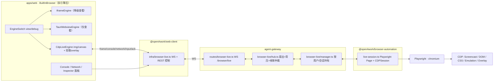

# 浏览器预览功能增强（开发调试便利化）

> **⏸️ 状态：部分挂起（2026-09-15）** — P0a / P3-core / 分发加固 / P0b / P1 可做部分 / P2 网络瀑布·HAR 已完成并验证（17/24）；**T-21 / T-22 / T-23 / T-24 按用户指示本轮挂起**（理由与可实施面见文末 Notes）；T-15 / T-18 受阻塞。
> 独立复验基线：浏览器域 `vitest` **14 文件 / 190 测试全绿**，`pnpm --filter @openAwork/web typecheck` **exit 0**。

## Task Overview

现有「浏览器预览」只是一个前端内置浏览器，对开发者调试 Agent 产出应用而言过于简陋。目标是把它从「能看网页」升级为「能开发调试」：看报错、看接口、选元素、把问题（含上下文/截图）一键丢给 Agent、响应式与设备预览、保存自动刷新，最终打通 Playwright/CDP 实现跨域与真浏览器调试。

主使用场景（用户确认）：**开发者自己调试 Agent 刚生成的应用**。

## Current Analysis

现状（已核实源码，非推测）：

- 预览本体是 `apps/web/src/components/chat/misc/BuiltInBrowser.tsx`（1230 行，已进 1300 预警区），宿主为 `EditorBrowserWorkspace.tsx` 的「代码/预览」Tab，由 `ChatPage` 驱动；桌面端把 `<iframe>` 换成 Tauri 原生 `Webview`。
- 已有：多标签（按 workspace 持久化）、地址栏、前进/后退/刷新、书签、历史、控制台面板（日志/网络/筛选/搜索/导出/复制 cURL/引用进输入框）、dev-server 就绪探测、`/open` 命令、终端输出自动识别 dev-server。
- console/network 采集靠 `browser/console-proxy.ts` 向 iframe 注入钩子（`postMessage` 上报），**仅同源可用**；跨域走 `catch {}` 静默失败。

### 六个硬伤

1. **跨域墙**：Web 用 iframe，非 localhost 无法预览；即便 `localhost:5173`，若 Web 应用不在同一 origin 仍是跨域，`contentWindow.document` 抛错 → 控制台/网络抓不到。
2. **Tauri 原生 webview 完全不可观测**——面板自己写着「Tauri 原生窗口模式下无法监听页面控制台与网络」。
3. **无真调试面板**：无网络瀑布/HAR、无 DOM/元素检查器、无 computed styles。
4. **无响应式/设备模拟/缩放**。
5. **与 Agent 脱节**：只能「复制/引用文本」，不能把选中的元素、报错、截图**结构化**喂回 Agent。
6. **面板形态弱 + 平行链路**：只是编辑器里的一个 Tab，拖拽是手写 mouse 逻辑（未复用 `PanelResizeHandle`）；已有的 Playwright 后端（`packages/browser-automation` + 网关 `/desktop-automation/*`）与它完全不相交。

### 关键约束（架构评审结论，Oracle 已确认）

- **`sandbox="allow-same-origin"` 不等于同源**：它只解除 opaque origin，跨端口依旧跨域 → **跨域元素拾取 / DOM / computed styles 在 iframe 内不可能实现**；同理 `html2canvas` 也读不到跨域 iframe 内容 → **「截图到对话」同样做不了**。这两项必须依赖 CDP 引擎。
- **CDP 引擎只在网关与浏览器同机时对 `localhost` 有效**。远端 Web 网关上的 Playwright 永远看不见用户笔记本的 `:5173` → 引擎必须**按运行时能力协商**，不是用户开关。
- 原生 Tauri `Webview` 是独立于 DOM 合成树的原生子窗口，浮在 React 之上 → **元素拾取十字光标 / `Overlay.highlightNode` 高亮 / hover 浮层一个都画不上去**。继续投入原生 webview 只会得到永远无法调试的预览器。

## Solution Design

**一句话架构：以「Playwright 真浏览器 + CDP 实时通道」作为唯一调试引擎，按运行时能力协商；iframe 仅保留为降级查看器；否决 dev-server 同源反代方案。**

### 引擎决策

- **采纳 CDP live view（chromium）**：Playwright 控制真浏览器，同源限制不存在，console/network/DOM/screencast/device emulation 全部来自一个引擎，且天然支持跨域。
- **否决反代 dev-server**：它只解决「同源可视化」，永远解决不了跨域站点；且 Vite HMR websocket / 绝对资源路径 / `base` / cookie domain / CSP / `X-Frame-Options` / 重定向 Location 全需重写，任一漏点即白屏或半坏；同时把任意本地端口的 SSRF 面暴露给前端。
- **保留 iframe / 原生 webview 作 view 模式**：零成本、秒开，但不再投入追平调试能力。

### 传输决策

- **WS 采纳**：`Page.startScreencast` 本质 ack 驱动（须逐帧 `screencastFrameAck`），且需回传鼠标/键盘 → 必须双向。复用 `@fastify/websocket` + 查询串 token 鉴权模式（同 `/sessions/:id/stream`）。
- **SSE 排除**（单向下行、无 ack 回路、base64 +33%）；仅保留为只读低频降级。
- **chunked HTTP**：HAR 导出、全分辨率截图下载等一次性 bulk。
- **信封**：`{ ch, seq, ts, sessionId, payload }`，`ch ∈ hello|frame|console|network|nav|dom|error|ack|input|control`。
- **背压**：客户端逐帧 `ack`；服务端收到 ack 才放行下一帧，并监控 `ws.bufferedAmount` 高低水位；帧率自适应 `clamp(min(cfg, 1000/rtt), 1, 15)`；多观看者按最慢连接仲裁。
- **缩小 chromium 依赖面**：console/pageerror/request/response/requestfailed/framenavigated 全走 Playwright `page.on(...)`（三引擎通用），仅 screencast / DOM-CSS / Emulation / Overlay 走 CDP。
- **帧永不入 artifact**；仅显式截图 / HAR 落盘且有上限。

### 分帧与数据流

## Complexity Assessment

- Atomic steps: 5+ → +2
- Parallel streams: yes → +2
- Modules or systems: 5 → +1
- Long step over 5 min: yes → +1
- Persisted review artifacts: yes → +1
- OpenCode available: yes → -1
- **Total score**: 6
- **Chosen mode**: Full orchestration
- **Routing rationale**: 跨 apps/packages/services 五层、含架构级 CDP 通道与前端重构，且原 P0 被引擎能力阻塞，必须纠偏顺序并保留可审计的计划状态。

## Implementation Plan

> **顺序纠偏（Oracle）**：原计划「P0 全量 → P1 → P2 → P3」不可实现。跨域拾取与截图到对话被引擎阻塞，故拆为 P0a（可立即发）→ **P3-core（必须先于 P0b）** → P0b → P1 → P2 → P3-remainder。

### Phase P0a：拆引擎 + 立即可交付的调试便利（前端，不阻塞）✅ 已完成（2026-09-15）

- [x] T-01: 拆 `BuiltInBrowser.tsx`（1230 → **692** 行）→ 实产出 `browser/hooks/use-tauri-webview.ts`(231) + `browser/BrowserToolbar.tsx`(331) + `browser/engines/browser-content-area.tsx`(194)；`BuiltInBrowser.test.tsx` 4/4 通过
- [x] T-02: 新增 `browser/hooks/use-engine-capability.ts`（`computeEngineCapability` 纯函数 + `useEngineCapability` hook），能力矩阵 `sameOrigin/domEval/screenshot/liveView/limitations`；10 测试通过
- [x] T-03: 新增 `browser/error-digest.ts`（`buildErrorDigest` / `sendErrorDigestToComposer` / `countErrorDigestProblems`），聚合 error 级 `ConsoleEntry` + 失败/4xx-5xx 请求 → composer markdown；14 测试通过
- [x] T-04: 接线 `BrowserToolbar` + `BuiltInBrowser`：`发送错误` 按钮（按 `problemCount` 启用）+ `元素拾取` 入口（按 `capability.domEval` 置灰并给出原因 tooltip）；端到端 composer 插入测试通过

> **T-01 计划漂移（已实施，优于原计划）**：原计划拆成 `engines/{iframe,tauri-webview}-engine.tsx` + `BrowserChrome.tsx`；实施时按真实职责边界改为三阶段——① Tauri webview 生命周期 → `hooks/use-tauri-webview.ts`；② 顶部 chrome → `BrowserToolbar.tsx`；③ 内容容器 → `engines/browser-content-area.tsx`。iframe / webview 两种渲染仍在 `browser-content-area.tsx` 内分支，未拆独立 engine 文件；`engines/` 家族留给 P3-core 的 `cdp-live-engine.tsx` 一并建立。
>
> **P0a 验收**：`vitest run src/components/chat/misc/browser src/components/chat/misc/BuiltInBrowser.test.tsx` → 7 文件 / **74 测试全绿**；`pnpm --filter @openAwork/web typecheck` → exit 0；新增/改动文件无硬编码色值、无新增 `any`（`use-tauri-webview.ts` 的 3 处 `any` 为原文件逐字搬运）。
>
> **待补**：真实浏览器视觉自查（375/768/1280）尚未执行——本机需完整 gateway + 预览站点环境；`元素拾取` 目前恒为禁用占位，功能在 P0b（CDP 引擎）落地。

### Phase P3-core：CDP live 通道（Large，必须先于 P0b）✅ 已完成（2026-09-15）

- [x] T-05: `packages/browser-automation/src/live-session.ts` + `live-session-types.ts`，从 `src/index.ts` 导出；`DesktopBrowserAutomation` 新增 `getCurrentPage(): Page`。**未创建 `live-proxy.ts`**（网关进程内直接持有 session，不经跨进程代理；`proxy.ts` 未改动）
- [x] T-06: `services/agent-gateway/src/browser-live/{manager,hub}.ts`——per-user 单例、懒加载 playwright、subscriber refcount、idle TTL 回收、扇出、**单帧信用背压 + 4s 看门狗 force-ack**、超限丢帧、控制器选举
- [x] T-07: `services/agent-gateway/src/routes/browser-live.ts`（**WS `GET /browser-live`**（不是计划里写的 `/browser/live`）+ REST `status/start/stop/screenshot`），注册进 `src/index.ts:238`
- [x] T-08: `/desktop-automation/status` 扩展 `liveView`（由 `browserLiveManager.availability()` 提供）
- [x] T-09: `packages/web-client/src/infra/browser-live.ts`（WS + REST 客户端，复用 `gateway/http.ts`）+ `src/index.ts` 导出
- [x] T-10: `browser/engines/cdp-live-engine.tsx`（555）+ `browser/hooks/use-browser-live-session.ts`（314）+ `browser/live-console-bridge.ts`（247）+ `hooks/use-cdp-live-pick.ts`（63）+ `hooks/use-browser-live-wiring.ts`（95，为守住主编排体积而抽出）；等比重排 + 按 `deviceWidth/Height` 换算坐标并 clamp + `img onLoad` 后 ack（含 500ms 兜底）+ mount `screencast.start` / unmount `screencast.stop`
- [x] T-11: 截图入 artifact（✅ 网关 `POST /browser-live/screenshot` → `createMediaArtifact`；WS `control.screenshot` 亦回帧内联 data）+ UI 断线重连（500ms→1s→2s→4s，≤5 次，重连后重发 `control.screencast.start`）+ 背压 ack 验证（✅ hub 信用门控测试 + 引擎 ack 去重）

> **P3-core 契约漂移（重要）**：wire 协议放 `packages/shared/src/browser-live.ts`（非 `browser-automation`）——`web-client` 不能依赖 Playwright，而网关与 web-client 须共用同一信封；`@openAwork/shared` 定位即「仅含消息/流类型」。
> **验收证据（真实运行，非模拟）**：`browser-automation` 10 个 **chromium 集成测试**全绿；`agent-gateway` browser-live 19 测试全绿（握手/1008/503/`liveView`/信用门控/看门狗/丢帧/控制器选举/idle 回收）；`web-client` 292 测试全绿；`apps/web` 浏览器域 **99 测试**全绿 + 下游 68 测试全绿 + **生产构建 exit 0**；四层 typecheck / `tsc -b` 均 exit 0。
>
> **P3-core 未完成的诚实缺口**：
> 1. **未做真实端到端联调**（桌面 sidecar + `DESKTOP_AUTOMATION=1` + chromium + UI 同时跑）——各层测试在边界处有 mock（网关不启动真浏览器、UI 用 mock 客户端），端到端尚未验证。
> 2. **视觉自查未做**（375/768/1280）——新引擎 UI 仅经单测，未经真实浏览器视觉走查。
> 3. **桌面端 Playwright 分发未解决（上线阻塞项）**：全仓无任何地方设置 `PLAYWRIGHT_BROWSERS_PATH`，`build:binary` 也不含浏览器二进制；用户机器上 `~/.cache/ms-playwright` 不存在时 live view 必然失败。需在 sidecar 启动注入 `PLAYWRIGHT_BROWSERS_PATH` 并随包分发 chromium（或首次运行引导安装）。
> 4. `BuiltInBrowser.tsx` 现为 **706 行**（P0a 目标 ≤700，超出 6 行）；仓库硬限 1500，暂无风险，但后续 P1/P2 加逻辑前应先抽 hook。

### Phase P0b：跨域拾取与完整上下文交付 🔵 进行中

- [x] T-12: **实现在包层而非新建 `browser/element-context.ts`**（漂移）——`packages/browser-automation/src/live-session.ts` 的 `buildUniqueSelector`：`data-testid` → `id` → `role=…[name="…"]` → `:nth-of-type` CSS path（经 `document.elementFromPoint` 单次 `page.evaluate` 生成），每步用 `page.locator(sel).count() === 1` 校验，取首个唯一者；全不唯一则返回 css-path 并诚实置 `selectorUnique: false`。新增 `BrowserLiveSelectorStrategy`、`selectorHint/selectorStrategy/selectorUnique`，并在 `@openAwork/shared` 的 `BrowserLiveNodePayload` 上以**可选字段**加法扩展、由网关转发
- [x] T-13: CDP 引擎拾取 overlay（十字光标 + 武装横幅 + Esc 退出 + 单次发送 + 命中反馈）+ composer 上下文块（selector + 策略 + 标签 + 文本截断 + 关键属性 + **computed styles 白名单**而非 451 条全量）
- [ ] T-14: 拾取与上下文交付的**测试已完成**（browser 域 119 测试，含 11 个新用例）；**真实浏览器视觉走查（375/768/1280）未做**——需完整 gateway + 认证 + 预览站点环境

> **T-13 验收**：`vitest run src/components/chat/misc/browser src/components/chat/misc/BuiltInBrowser.test.tsx` → 10 文件 / **119 测试**全绿；`tsc -b tsconfig.build.json` **exit 0**；无硬编码色值、无新增 `any`。拾取态点击**不透传**远端（否则选元素会顺带触发页面交互），Esc 在窗口捕获阶段解除武装；styles 白名单（display/position/size/color/background/font/margin/padding/border-radius/z-index/opacity/visibility/overflow）避免把 400+ 条 computed style 灌给 Agent。

> **T-12 验收**：`browser-automation` typecheck exit 0 + **14 个真实 chromium 测试**（含"data-testid 重复时必须降级到唯一选择器"、"css-path 可重新解析到同一元素"）；`shared` typecheck exit 0；gateway browser-live 28 测试全绿。
> **T-12 漂移说明**：计划写在 `apps/web/browser/element-context.ts`，实际放在包层 `live-session.ts`——因为唯一性校验必须调用 Playwright 的 `page.locator()`，只有能访问 Page 的包层能可靠做到；Web 层只消费服务端已校验的选择器。

### Phase P1：预览升格一等公民（UI 为主，与 P3 解耦）🔵 进行中（2 项被阻塞/推迟）

- ⛔ T-15: 预览可停靠面板——**阻塞**。目标文件 `apps/web/src/pages/chat-page/ChatPage.tsx` 与 `conversation/**`（含 `ChatConversationView.tsx`、`use-composer-callbacks.ts`、`use-composer-menu-items.ts`）正被用户并行大改（`apps/web/src` 下 82 个文件处于修改态）。此时改造面板宿主必撞车。
- [x] T-16: 统一拖拽原语——已确认存在**两个**原语（`layout/shared/PanelResizeHandle.tsx` 与 `layout/shared/resize-handle.tsx`），采纳后者 `ResizeHandle`（pointer capture + 键盘 + ARIA）。`EditorBrowserWorkspace.tsx`（-83）与 `WorkspaceEditorOverlay.tsx`（-98）共删掉 125 行手写 JSON 拖拽，纯约束/单位换算抽到新文件 `file-editor/workspace-resize.ts`（+test）。**未触碰任何持久化键**：文件树宽度仅存内存（140–480px），编辑器分屏持久化值为 20–80 百分比（既有 store 契约原样保留）
- [x] T-17: `browser/device-presets.ts`（103 行：6 个预设含 375×812@2 / 430×932@3 / 768×1024@2 / 1280×800 / 1920×1080 + 自适应）＋缩放档位＋设备 UA；`BrowserToolbar.tsx` 增设备/缩放控制条，**Tauri 原生 webview 下自动隐藏该条**（原生 webview 无法按 CSS 定尺寸，避免出现无效控件——很诚实的处理）。zoom = 纯客户端 CSS `transform: scale`，输入坐标除以缩放系数；自适应预设发送容器实测尺寸而非新增"清除"协议消息；协议仅在 `BrowserLiveDeviceMessage` 上**加法**新增可选 `userAgent?`
- [x] T-19: 快捷键已接线完成——新增 `hooks/use-browser-preview-shortcuts-wiring.ts`（专用接线 hook，不在主编排里堆逻辑）＋ `browser-shortcut-hints.tsx`（提示从 `BROWSER_PREVIEW_SHORTCUTS` 派生，文件内注明"禁止手写快捷键字面量"，从结构上防漂移）。**`BuiltInBrowser.tsx` 811 → 750 行**（按要求压回去而非继续增长）

### Phase P2：真调试面板

- [x] T-20: 网络瀑布 + HAR 导出（先用 Playwright `request/response` 事件，跨引擎）— 实产出 `browser/NetworkWaterfall.tsx`（31KB，纯函数几何/状态分类可单测）、`browser/network-har.ts`（HAR 1.2 生成 + 下载），已接线 `BrowserConsolePanel.tsx`；数据与列表视图同源（同一份 `ConsoleEntry[]`），不另建网络存储
- [ ] ⏸️ T-21: DOM / a11y 检查器 + computed styles + copy selector（CDP 域）— **已挂起**（用户决定本轮不执行本方案）
- [ ] ⏸️ T-22: 控制台 sourcemap 堆栈映射（`Debugger.scriptParsed` + dev-server source map）— **已挂起**（用户决定本轮不执行本方案）
- [ ] ⏸️ T-23: 测试 + 视觉 / 浏览器 QA（375 / 768 / 1280）— 挂起（依赖 T-21/T-22）

### Phase P3-remainder：收口

- [ ] ⏸️ T-24: 远端 / 多引擎能力协商收口 + 文档沉淀（DESIGN-TOKENS 与运行手册）— 挂起

## Notes

- **⏸️ 本轮挂起决定（2026-09-15，用户指示）**：用户明确「完成其他的方案，不执行这个方案」→ T-21 / T-22 / T-23 / T-24 全部挂起，本轮不实施。挂起的技术依据（实测，非推测）：执行前探测发现**存在并发写入会话**正在修改本方案的前端文件域 — `apps/web/src/components/chat/misc/browser/BrowserConsolePanel.tsx`(22:15)、`NetworkWaterfall.tsx`(22:21)、`network-har.ts`、`browser-console-types.ts`、`live-console-bridge.ts`、`BuiltInBrowser.tsx`、`browser-live-harness.tsx`(22:27)；同时机器上有 3 个长驻 `opencode` 进程 + 既有 gateway dev(tsx watch) + vite --port 5199。T-21 的主 UI 目标 `BrowserConsolePanel.tsx` 正处于该争用区，此时实施必然产出需手工调和的冲突。
  - **探明的可实施面（供后续接手）**：协议/后端 5 个文件当时空闲 — `packages/shared/src/browser-live.ts`(16:57)、`browser-live/hub.ts`(19:01)、`routes/browser-live.ts`(19:32)、`browser-automation/src/live-session.ts`(21:43)、`web-client/src/infra/browser-live.ts`(20:02)。
  - **前置事实（已实测，避免接手者重复调研）**：① 仓库内**无任何 sourcemap 库**（`source-map` / `@jridgewell/trace-mapping` / `source-map-js` / `@jridgewell/sourcemap-codec` 全部缺失，无 workspace 声明）→ T-22 必须先做依赖决策；② CDP `Accessibility.*` / `Debugger.*` 域在本仓**从未使用过**；③ `web-client` 对上行消息**不做 action 白名单**（协议扩展在客户端零摩擦）；④ `BrowserConsolePanel.tsx` 当前恰为两个 view（`'list' | 'waterfall'`）的 pill 切换器。
- **T-20 文档漂移修正（2026-09-15）**：T-20（网络瀑布 + HAR）**实际已落地并接线**（`browser/NetworkWaterfall.tsx` 31KB + `browser/network-har.ts`，`BrowserConsolePanel.tsx:260` 已消费），但 master_plan / workflow / index 三处此前仍记 🟡 Pending。已回写 ✅，并独立复验：`vitest run src/components/chat/misc/browser src/components/chat/misc/BuiltInBrowser.test.tsx` → **14 文件 / 190 测试全绿**；`pnpm --filter @openAwork/web typecheck` → **exit 0**。

- **Gate 1（计划先行）**：本文档为规划产物，代码实施需用户显式批准后开始。
- **仓库硬约束**：新增网关路由必须先落 `packages/web-client` 客户端；`apps/` 与 `packages/`（web-client 除外）禁止直连网关 `fetch`；纯 ESM + NodeNext（`.js` 后缀）；禁 `any` / `@ts-ignore` / 空 catch；单文件 ≤1500 行；UI 必须走 E·Nebula token（禁硬编码色值），UI 改动前读 `packages/shared-ui/DESIGN-TOKENS.md`。
- **不可回避的风险**：① 帧洪泛（ack 背压 + 帧率自适应 + 帧不入 artifact）② 网关位置导致的引擎不可用（status 能力协商 + 明确降级文案）③ live session 与 `desktopAutomationManager` 单例抢同一 Page（必须按用户/会话隔离）④ Playwright chromium 二进制打包（`PLAYWRIGHT_BROWSERS_PATH` + sidecar 分发，`build:binary` 不含浏览器）⑤ SSRF（仅 http(s)、显式操作、仅同机运行时）。
- **补充风险（Oracle）**：sandbox 逃逸（`allow-same-origin` + `allow-scripts` 同源时可自摘 sandbox，应按 URL origin 决策）；WS token 走查询串须避免落日志；多观看者 screencast 必须以最慢连接 ack；sourcemap 堆栈是 P2 最易低估项；zoom 三种语义（`setPageScaleFactor` / `deviceScaleFactor` / CSS zoom）须先定义。
- **禁止事项**：严禁任何 `git reset/revert/restore/clean` 类回滚指令；工作树可能混有并行用户修改，不得整理无关文件。
- **验证基线**：`pnpm typecheck`、定向 vitest、`pnpm --filter @openAwork/web build`；UI 交付需真实浏览器视觉自查。

## 首次真实端到端验收（2026-09-15，不经 UI 直打网关）

做法：本机起真网关（`DESKTOP_AUTOMATION=1` + `tsx src/index.ts`，端口 3099，数据目录 `/tmp/opencode/e2e-data`）＋用 `POST /auth/desktop-default`（`x-openawork-desktop-auth`）换真 JWT，再用 `Bun.serve` 起本地测试页，最后用 WS 走完整链路。复现脚本：`/tmp/opencode/browser-live-e2e.ts`、`diag3.ts`。

**通过**：`auth/desktop-default` → `GET /browser-live/status` → `/desktop-automation/status` 含 `liveView` → WS 握手 `hello`（engine `chromium`, screencast true）→ `control.navigate` 产出 `nav`（标题 `e2e-page`，**证明 nav 竞态修复有效**）→ `console` 透传（level warn）→ `network` 透传（status 200）→ screencast 收帧（1280×720，10592B）→ **`pick` 返回 `[data-testid="e2e-btn"]` 且 `selectorUnique: true`** → `ping`→`pong` → 非法指令 → `error` 信封 → **信用门控生效**（有未确认帧时不再下发新帧）。

**发现 3 个真实缺陷（mock 测试无法覆盖）**：
1. **ack 后重复发布同一帧**（`diag3` 可复现）：帧 id=6 在 +2015ms 发布 → +3502ms ack → **+3827ms 又收到 id=6**，此后 7s 无新帧；不 ack 时单次重绘只产一帧，故重复由 ack 路径引入。
2. **`availability()` 不幂等**：`manager.ts:305` 在无热会话时直接 `return { available: true, engine: null, screencast: false }`，与"探针已解析出 chromium"矛盾 → 全新启动的应用会向 UI 误报"无实时/无 screencast 引擎"，破坏能力门控。
3. **`hello.viewport` 恒为 `null`**（route 硬编码）。
→ 三项已修复，并由**我自己的 E2E 独立复验**：修后 16/17 PASS，`screencast` 帧 id 由 1 → ack 后 2（**逐帧唯一**），`ack 后继续产帧（背压放行）` 由 FAIL 转 PASS；**首次** `/browser-live/status` 即 `{available:true, engine:"chromium", screencast:true}`（幂等）；`hello` 信封**不再含 `viewport` 字段**；重复 testid 正确降级 `{"selector":"[id=\"dup\"]","strategy":"id","unique":true}`。

**缺陷 1 的真实根因（推翻了任务前提，由原始 CDP 探针证实）**：CDP `Page.screencastFrame.sessionId` 标识的是**一次 screencast 会话**，会话内对所有帧**恒定不变**，只有重新 `Page.startScreencast` 才递增。之前看到的 1..6 是多次重连累积所致，并非逐帧递增。而 hub 把它**原样透传**为线路 `frameSessionId`，于是"帧唯一标识"不唯一。后果不只是"重复 id"：`cdp-live-engine.tsx` 用 `ackedFrameRef.current === frameSessionId` 去重，**第二帧起会被直接丢弃（不渲染、不回 ack）→ 实况画面实际停在第一帧**。修法：每个 fanout 维护单调 `frameCounter` 合成线路 id，另存真实 CDP id，ack/看门狗用线路 id 匹配信用后**映射回真实 CDP id** 再 `ackScreencastFrame`。

**缺陷 4（✅ 已修复并验证）**：`POST /browser-live/screenshot` 原不校验 `sessionId` → 外键炸 → 被包成 500 `browser_live_failed`。修法：按 `user.sub` 校验会话归属 → **404 + `browser_live_session_not_found`**（`browser-live.ts:619-625`）；`classifyBrowserLiveError` 增 `isSqliteConstraintError` 分支（约束错误归类为 `browser_live_invalid_data`，不再伪装 500）。
**验收（我实测）**：伪造 sessionId → **HTTP 404 + `目标会话不存在或不属于当前账号。`**；`browser-live-e2e.ts` **20/20 PASS**（含 `POST /sessions` 建真实会话 → 截图落 artifact `浏览器实时预览截图.png` → `GET /artifacts/:id` 200 → 未知 id 404 类型化）；`client-seam.ts` 全绿（含真实会话截图 + 未知会话 404）；网关 typecheck exit 0 + **42 个 browser-live 测试**通过。

### UI 渲染层验证（临时 harness，真实浏览器）

做法：临时新增 `apps/web/browser-live-harness.html` + `apps/web/src/browser-live-harness.tsx`（**用完即删**），用 `useAuthStore.setState` 注入 token/gateway，直接挂载真实 `useBrowserLiveSession` + `CdpLiveEngine`，跑 `vite dev`（5199）+ headless chromium（脚本 `/tmp/opencode/ui-verify2.ts`）。

**抓到致命缺陷 5（已派发修复）——「实时预览永远停在白屏」**：
- `use-browser-live-session.ts:291` 的 `send` 是 `connectionRef.current?.send(message)`——**未连接时静默丢弃**；而 `connectionRef` 只在 `connect()` 时赋值，`connect()` 还要等 `getStatus` 的 REST 往返。
- React effect **子先父后**：引擎（子）挂载即发 `control.navigate` 与 `control.screencast.start`，**早于** hook（父）建立连接 → 两条都被丢弃。且 `cdp-live-engine.tsx:432` 的 screencast 挂载效应**无 phase 门控**（对比 line 504 的 device 效应有 `phase !== 'connected'` 门控）。
- **证据**：harness 下 hook 到达 `phase=connected`、`` 解码出真实 1600×1000 JPEG（`complete=true`），但对该帧做 **canvas 像素采样全为纯白 `rgb(255,255,255)`**，而目标页是 `rgb(11,94,168)` 蓝色 → **远端从未被导航**。帧之所以仍在流，只是因为**热会话把上一轮的 screencast 留在活动状态**。
- **教训**：这一步最初"帧渲染成功"的结论是**误导性的**——DOM 断言只能证明"有 JPEG 被绘制"，证明不了"画的是对的页面"。**只有像素采样戳穿了它**。这也很可能就是最初"预览功能太简陋/不好用"的根源。
- 修法：hook 侧为 `send` 加**有界待发队列**（未连接时入队、连接后按序 flush、`close()` 清空）；引擎侧把 `screencast.start` 改为**按 `phase` 门控**并在重连后重新请求。
