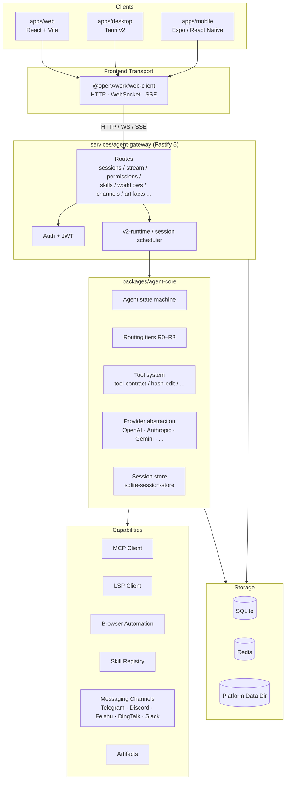
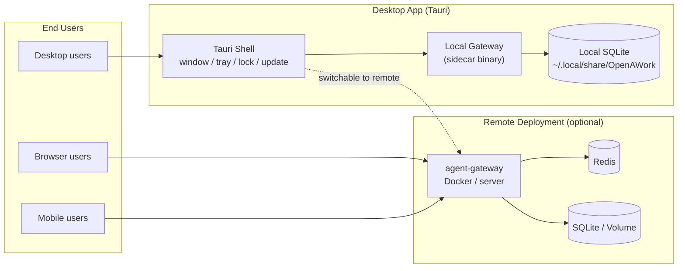
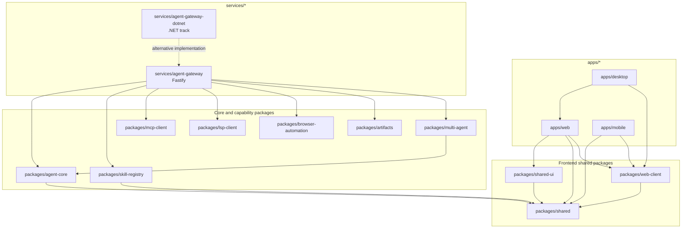

# OpenAWork

> A cross-platform AI Agent workspace that brings conversations, tool execution, workflows, artifact management, and multi-platform collaboration into one product and engineering system.

**Language / 语言**

- [中文（默认）](./README.md)
- **English**

---

## Overview

OpenAWork is a **cross-platform AI Agent workspace** built for long-running, real work scenarios.

It is more than a chat UI and more than a model gateway. The repository combines:

- a **Web** workspace as the primary UI
- a **Desktop** app built with Tauri
- a **Mobile** app built with Expo / React Native
- a **Gateway** service for auth, sessions, streaming, permissions, skills, workflows, artifacts, and integrations
- an **Agent Core** layer for state machines, routing, tools, providers, and session storage

In short, OpenAWork is best understood as:

- an **AI Agent control plane**
- a **unified multi-platform workspace**
- an **extensible engineering foundation for agent products**

## Core Capabilities

- **Chat workspace**
  - streaming responses
  - tool call visualization
  - attachment and artifact integration

- **Workflow and multi-agent support**
  - workflow pages
  - scheduled jobs
  - DAG-style orchestration support

- **Skill and tool system**
  - local and installed skills
  - permission-aware tool execution
  - extensions around MCP, LSP, browser automation, and SSH

- **Artifact center**
  - centralized management for outputs and generated assets

- **Team and template support**
  - team workspace, template management, and agent management entry points

- **Channel integrations**
  - gateway-side messaging channel infrastructure
  - integrations for Telegram, Discord, Feishu, DingTalk, Slack, and more

- **Cross-platform consistency**
  - shared product semantics and partial component reuse across Web, Desktop, and Mobile

## Current Product Surface

The current frontend routes already show a broad workspace surface:

- **Chat workspace**: `/chat/:sessionId?`
- **Sessions**: `/sessions`
- **Artifacts**: `/artifacts`
- **Settings**: `/settings/:tab?`
- **Skills**: `/skills`
- **Workflows**: `/workflows`
- **Team**: `/team`
- **Templates**: `/templates`
- **Agents**: `/agents`
- **Usage**: `/usage`
- **Schedules**: `/schedules`

This makes OpenAWork much closer to an **AI workspace / agent operating console** than a single-purpose chat app.

## Architecture

OpenAWork is a layered, multi-platform, modular system. The following three diagrams show its relationships from **system layers, deployment topology, and package dependencies**.

### 1. System Layers



### 2. Multi-platform Deployment Topology



### 3. Package Relationship Graph



## Platform and Service Layers

- **`apps/web`**
  - primary React workspace
  - currently the most complete UI surface

- **`apps/desktop`**
  - Tauri v2 desktop wrapper
  - directly reuses web pages and state instead of maintaining a separate desktop UI
  - supports local or remote gateway connection, tray actions, updates, lock flows, and pairing

- **`apps/mobile`**
  - Expo Router / React Native entry for mobile scenarios
  - suited for mobile access to sessions, connection flows, and lighter workspace interactions

- **`services/agent-gateway`**
  - the default backend used by root scripts and Docker
  - built with Fastify for API, WebSocket, SSE, auth, sessions, skills, workflows, channels, and artifacts

- **`services/agent-gateway-dotnet`**
  - a parallel .NET gateway solution maintained in the repository
  - useful when exploring backend evolution or sidecar publishing paths

## Core Package Layers

- **`packages/agent-core`**
  - agent state machine
  - tool contract and registration
  - provider management
  - routing tiers
  - session storage and workflow logic

- **`packages/shared`**
  - shared message and streaming types
  - keeps data structures aligned across platforms

- **`packages/shared-ui`**
  - a broad set of reusable UI components
  - covers logs, permissions, skills, workflows, artifacts, model configuration, and other advanced surfaces

- **`packages/web-client`**
  - client-side gateway communication layer
  - used by Web and Desktop frontend flows

- **`packages/skill-registry`**
  - skill installation, lifecycle, and isolation support

- **`packages/multi-agent`**
  - DAG-style multi-agent orchestration support

- **`packages/mcp-client` / `packages/lsp-client` / `packages/browser-automation`**
  - integrations for MCP, language services, and browser automation

## Tech Stack

### Frontend

- React 19
- Vite 6
- React Router 7
- Zustand
- Tailwind CSS v4

### Desktop

- Tauri v2
- local gateway integrated as a sidecar

### Mobile

- Expo Router
- React Native
- Expo Dev Client / Secure Store / SQLite capabilities

### Backend and Runtime

- Fastify 5
- WebSocket + SSE
- TypeScript strict mode
- Zod
- better-sqlite3
- Effect / Drizzle (visible in part of the runtime path)

### Engineering Tooling

- pnpm workspace monorepo
- Node.js `>= 22.13.0`
- pnpm `>= 10.0.0`
- ESM / NodeNext module system
- ESLint + Prettier
- Husky + Commitlint

### Testing and Verification

- Vitest
- Playwright
- script-driven verification tests

## Repository Layout

```text
OpenAWork/
├── apps/
│   ├── web/                  # Primary React workspace
│   ├── desktop/              # Tauri desktop app
│   └── mobile/               # Expo mobile app
├── packages/
│   ├── agent-core/           # Agent runtime core
│   ├── shared/               # Shared types
│   ├── shared-ui/            # Shared UI components
│   ├── multi-agent/          # Multi-agent orchestration
│   ├── skill-registry/       # Skill lifecycle and registry
│   ├── web-client/           # Frontend gateway client
│   ├── mcp-client/           # MCP client
│   ├── lsp-client/           # LSP client
│   ├── browser-automation/   # Browser automation
│   ├── artifacts/            # Artifact support
│   └── ...
├── services/
│   ├── agent-gateway/        # Default gateway
│   └── agent-gateway-dotnet/ # .NET gateway track
├── docs/                     # Supporting docs
├── scripts/                  # Build and version scripts
├── AGENTS.md                 # Project knowledge base and conventions
├── DESIGN.md                 # Shared design baseline
└── DESIGN.openawork.md       # OpenAWork-specific design notes
```

## Running the Project

OpenAWork currently has two common ways to run:

- **Local development**
  - start apps and services in the monorepo via `pnpm`
  - suitable for frontend, gateway, and shared-package iteration

- **Docker**
  - `docker-compose.yml` is included
  - starts `gateway + web + redis` by default
  - useful for quickly bootstrapping the base environment

Default ports:

- **Gateway**: `3000`
- **Web**: `5173`
- **Redis**: `6379`

## Quick Start

### 1. Install dependencies

```bash
pnpm install
```

### 2. Configure environment variables

```bash
cp .env.example .env
```

At minimum, review:

- `JWT_SECRET`
- `REDIS_URL`
- `AI_API_KEY`
- `AI_API_BASE_URL`
- `AI_DEFAULT_MODEL`
- `OPENAWORK_DATA_DIR` (optional, but recommended)

### 3. Start local development

```bash
pnpm dev
```

### 4. Or start with Docker

```bash
docker compose up --build
```

## Common Commands

```bash
# Start all workspaces
pnpm dev

# Build all packages
pnpm build

# Type check
pnpm typecheck

# Run all tests
pnpm test

# Run E2E tests
pnpm test:e2e

# Run gateway only
pnpm --filter @openAwork/agent-gateway dev

# Run desktop app
pnpm --filter @openAwork/desktop dev

# Run mobile app
pnpm --filter @openAwork/mobile dev
```

## Who This Project Is For

OpenAWork is a strong fit for:

- **Individual developers**
  - who want a unified workspace for chat, tools, file operations, and artifact output

- **AI product / platform teams**
  - who need a manageable, extensible, multi-platform agent foundation

- **Automation and orchestration scenarios**
  - where workflows, scheduled jobs, multi-agent collaboration, and permissions matter

- **Teams with self-hosted or desktop requirements**
  - who want Web plus Desktop / Mobile delivery paths

## Suggested Reading Order

1. **`AGENTS.md`**
   - best entry point for repository knowledge and conventions
2. **`package.json` + `pnpm-workspace.yaml`**
   - understand the monorepo structure quickly
3. **`apps/web/src/App.tsx`**
   - see the frontend entry and route surface
4. **`services/agent-gateway/src/index.ts`**
   - understand the default gateway boot flow and backend assembly
5. **`packages/agent-core/src/`**
   - dive into the state machine, tool system, providers, sessions, and workflow logic
6. **`DESIGN.md` / `DESIGN.openawork.md`**
   - understand the design and interaction rules for the product

## Repository Character

OpenAWork can be summarized as:

- **not a single app, but a platform-style workspace**
- **not frontend-only, but a multi-platform full-stack engineering system**
- **not just model calling, but a system centered on agent execution flows**
- **not a throwaway demo, but a long-term project with clear conventions, tests, and extension boundaries**
