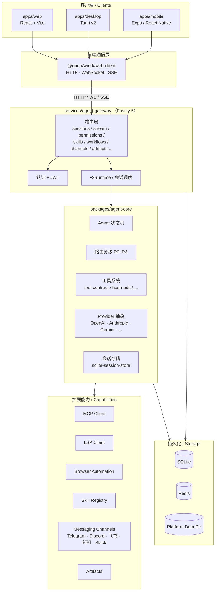
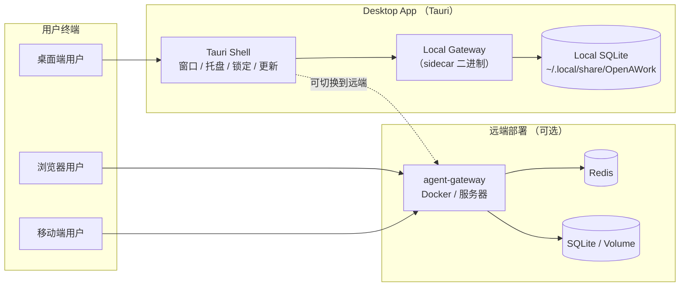
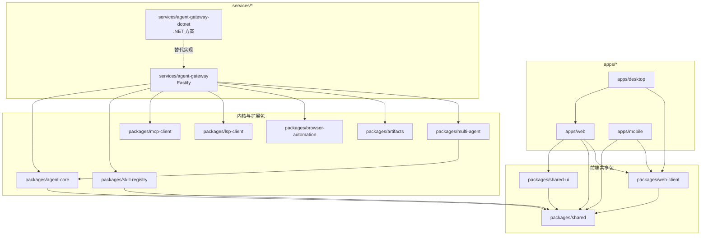

# OpenAWork

> 跨平台 AI Agent 工作台：把对话、工具调用、工作流、产物管理与多端协作放到同一套产品与工程体系中。

**语言 / Language**

- **中文（默认）**
- [English](./README.en.md)

---

### 项目简介

OpenAWork 是一个面向 **连续工作场景** 的跨平台 AI Agent 工作台。

它不是单纯的聊天界面，也不是只负责模型调用的后端服务，而是一套完整的产品与工程组合：

- **Web** 端提供主工作台体验
- **Desktop** 端通过 Tauri 封装桌面能力，并将本地 Gateway 作为 sidecar 集成
- **Mobile** 端提供移动场景下的会话、设置与连接能力
- **Agent Gateway** 负责认证、会话、流式输出、权限、技能、工作流、产物、消息频道与系统集成
- **Agent Core** 提供状态机、路由分级、工具系统、Provider 抽象、会话存储与工作流能力

你可以把 OpenAWork 理解为：

- 一个 **AI Agent 控制台**
- 一个 **多端统一工作台**
- 一个 **可扩展的 Agent 工程基座**

### 核心能力

- **会话工作台**
  - 支持流式输出、工具调用展示、附件与产物联动
  - 面向持续使用场景，而非一次性问答

- **工作流与多 Agent 能力**
  - 支持工作流页面、计划任务与 DAG 编排能力
  - 适合需要多步骤执行、状态追踪与自动化的场景

- **技能与工具系统**
  - 内置本地技能、安装技能、权限控制与工具注册体系
  - 可扩展 MCP、LSP、Browser Automation、SSH 等能力

- **产物中心**
  - 统一管理会话输出、文件与其他产物
  - 便于沉淀 Agent 执行结果与后续复用

- **团队协作与模板复用**
  - 提供团队空间、模板管理、Agent 管理等功能入口
  - 适合把个人工作流升级成团队可复用流程

- **多通道接入**
  - Gateway 侧已包含消息频道体系
  - 支持将能力接入 Telegram、Discord、飞书、钉钉、Slack 等通道

- **跨平台一致体验**
  - Web、Desktop、Mobile 共用一套核心模型与部分共享组件
  - 保持产品语义与工作流体验的一致性

### 主要页面与功能面

从当前前端路由可以看到，OpenAWork 已经覆盖了一套较完整的工作台能力：

- **会话工作台**：`/chat/:sessionId?`
- **会话列表**：`/sessions`
- **产物中心**：`/artifacts`
- **设置中心**：`/settings/:tab?`
- **技能库**：`/skills`
- **工作流工作台**：`/workflows`
- **团队协作**：`/team`
- **模板管理**：`/templates`
- **Agent 管理**：`/agents`
- **用量统计**：`/usage`
- **计划任务**：`/schedules`

这意味着 OpenAWork 的定位已经明显超出“聊天产品”，更接近一个 **AI 工作操作系统 / Agent Workspace**。

### 架构概览

OpenAWork 是一个分层、多端、模块化的系统。下面三张图分别从 **系统分层、部署拓扑、包依赖** 三个角度展示它的关系结构。

#### 1. 系统分层架构图



#### 2. 多端部署拓扑图



#### 3. 核心包依赖关系图



### 多端与服务关系

- **`apps/web`**
  - React + Vite 的主工作台实现
  - 当前最完整的 UI 功能入口

- **`apps/desktop`**
  - 基于 Tauri v2 的桌面端
  - 直接复用 Web 页面与状态管理，而不是维护一套独立桌面 UI
  - 可连接本地或远程 Gateway，并提供托盘、更新、锁定、配对等桌面能力

- **`apps/mobile`**
  - 基于 Expo Router / React Native 的移动端入口
  - 更适合移动场景下查看会话、连接设备、进入轻量工作流

- **`services/agent-gateway`**
  - 当前仓库根脚本与 Docker 默认使用的网关实现
  - 基于 Fastify，负责 API、WebSocket、SSE、认证、会话、技能、工作流、频道、产物等后端能力

- **`services/agent-gateway-dotnet`**
  - 仓库中同时维护了一套 .NET 网关解决方案
  - 适合关注后端演进、sidecar 发布与替代实现时查看

### 核心包分层

以下包最能代表 OpenAWork 的工程骨架：

- **`packages/agent-core`**
  - Agent 状态机
  - 工具注册与调用契约
  - Provider 管理
  - 路由分级
  - 会话存储与工作流逻辑

- **`packages/shared`**
  - 共享消息与流式类型定义
  - 保持跨端数据结构统一

- **`packages/shared-ui`**
  - 大量跨页面、跨端可复用的 UI 组件
  - 覆盖日志、权限、技能、工作流、产物、模型配置等复杂界面

- **`packages/web-client`**
  - 浏览器端 Gateway 通信层
  - 承担 Web / Desktop 前端与网关之间的连接与认证辅助

- **`packages/skill-registry`**
  - 技能安装、生命周期与安全隔离相关能力

- **`packages/multi-agent`**
  - 多 Agent 工作流 DAG 编排能力

- **`packages/mcp-client` / `packages/lsp-client` / `packages/browser-automation`**
  - 分别扩展 MCP、语言服务与浏览器自动化能力

### 技术栈

#### 前端

- React 19
- Vite 6
- React Router 7
- Zustand
- Tailwind CSS v4

#### 桌面端

- Tauri v2
- 通过 sidecar 集成本地 Gateway

#### 移动端

- Expo Router
- React Native
- Expo Dev Client / Secure Store / SQLite 等能力

#### 后端与核心能力

- Fastify 5
- WebSocket + SSE
- TypeScript 严格模式
- Zod
- better-sqlite3
- Effect / Drizzle（部分运行时路径已可见）

#### 工程体系

- pnpm workspace monorepo
- Node.js `>= 22.13.0`
- pnpm `>= 10.0.0`
- ESM / NodeNext 模块体系
- ESLint + Prettier
- Husky + Commitlint

#### 测试与验证

- Vitest
- Playwright
- 脚本化 verification tests

### 目录速览

```text
OpenAWork/
├── apps/
│   ├── web/                  # React 主工作台
│   ├── desktop/              # Tauri 桌面端
│   └── mobile/               # Expo 移动端
├── packages/
│   ├── agent-core/           # Agent 内核
│   ├── shared/               # 共享类型
│   ├── shared-ui/            # 共享 UI 组件
│   ├── multi-agent/          # 多 Agent 编排
│   ├── skill-registry/       # 技能注册与生命周期
│   ├── web-client/           # 前端网关客户端
│   ├── mcp-client/           # MCP 客户端
│   ├── lsp-client/           # LSP 客户端
│   ├── browser-automation/   # 浏览器自动化
│   ├── artifacts/            # 产物能力
│   └── ...
├── services/
│   ├── agent-gateway/        # 当前默认网关
│   └── agent-gateway-dotnet/ # .NET 版网关方案
├── docs/                     # 辅助文档
├── scripts/                  # 构建与版本脚本
├── AGENTS.md                 # 项目知识库 / 开发约定
├── DESIGN.md                 # 通用设计基线
└── DESIGN.openawork.md       # OpenAWork 设计补充
```

### 运行方式

OpenAWork 当前有两条最常见的运行方式：

- **本地开发模式**
  - 使用 `pnpm` 启动 monorepo 下各应用与服务
  - 适合前端、网关与共享包联调

- **Docker 模式**
  - 仓库已提供 `docker-compose.yml`
  - 默认启动 `gateway + web + redis`
  - 适合快速拉起基础运行环境

默认端口：

- **Gateway**：`3000`
- **Web**：`5173`（Docker 场景下由宿主 `5173` 映射到容器 `80`）
- **Redis**：`6379`

### 快速开始

#### 1. 安装依赖

```bash
pnpm install
```

#### 2. 配置环境变量

```bash
cp .env.example .env
```

至少需要关注：

- `JWT_SECRET`
- `REDIS_URL`
- `AI_API_KEY`
- `AI_API_BASE_URL`
- `AI_DEFAULT_MODEL`
- `OPENAWORK_DATA_DIR`（可选，但建议明确）

#### 3. 启动开发环境

```bash
pnpm dev
```

#### 4. 或使用 Docker 快速拉起

```bash
docker compose up --build
```

### 常用命令

```bash
# 启动所有 workspace
pnpm dev

# 构建共享包、服务与 Web
pnpm build

# 类型检查
pnpm typecheck

# 全量测试
pnpm test

# E2E 测试
pnpm test:e2e

# 仅启动网关
pnpm --filter @openAwork/agent-gateway dev

# 启动桌面端
pnpm --filter @openAwork/desktop dev

# 启动移动端
pnpm --filter @openAwork/mobile dev
```

### 适合谁使用

OpenAWork 适合以下几类场景：

- **个人开发者**
  - 想把聊天、工具调用、文件处理、产物输出集中到同一个 Agent 工作台

- **AI 产品/平台团队**
  - 想构建一个可管理、可扩展、可多端接入的 Agent 平台底座

- **自动化与流程编排场景**
  - 需要工作流、计划任务、多 Agent 协作与权限控制

- **有私有化或桌面化需求的团队**
  - 希望在 Web 之外，进一步提供 Desktop / Mobile 体验

### 建议阅读顺序

如果你要继续深入理解这个项目，建议按下面顺序阅读：

1. **`AGENTS.md`**
   - 最适合作为项目知识总入口
2. **`package.json` + `pnpm-workspace.yaml`**
   - 快速理解 monorepo 组织方式
3. **`apps/web/src/App.tsx`**
   - 了解前端页面入口与整体路由面
4. **`services/agent-gateway/src/index.ts`**
   - 了解当前默认网关的启动过程与后端能力装配
5. **`packages/agent-core/src/`**
   - 深入理解状态机、工具系统、Provider、会话与工作流逻辑
6. **`DESIGN.md` / `DESIGN.openawork.md`**
   - 了解产品视觉与交互风格的落地规则

### 当前仓库特征总结

OpenAWork 的明显特征可以概括为：

- **不是单点应用，而是平台型工作台**
- **不是只做前端，而是前后端一体化的多端工程**
- **不是只做模型调用，而是围绕 Agent 执行过程构建完整系统**
- **不是一次性 Demo，而是有明确工程规范、测试体系与扩展边界的长期项目**

---

**English version**: [README.en.md](./README.en.md)
